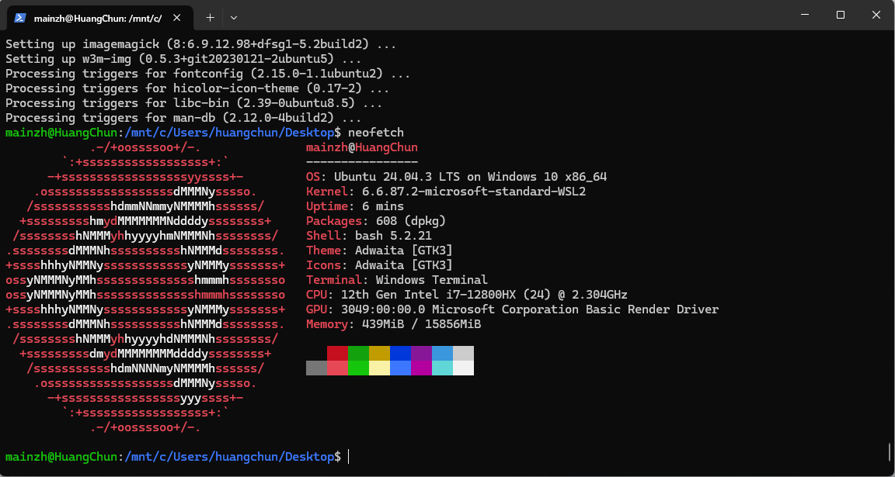
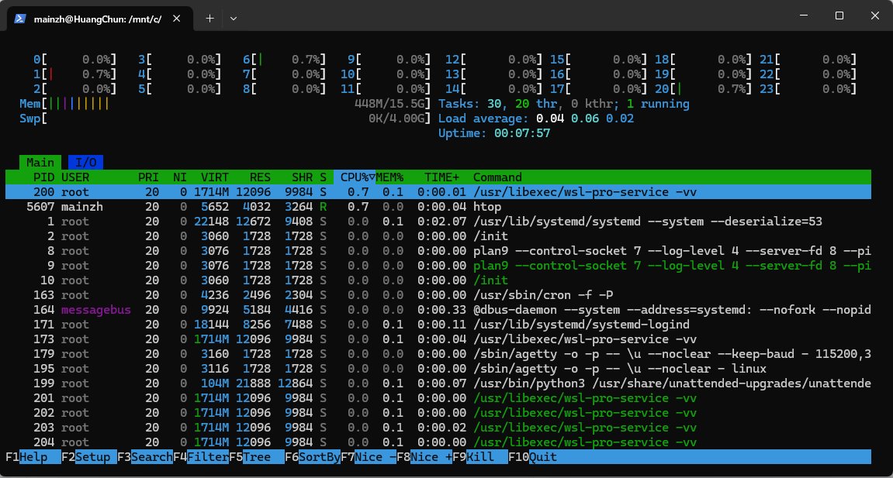

参考：[【北京迅为】嵌入式Linux基础教程（高清重制版）_哔哩哔哩_bilibili](https://www.bilibili.com/video/BV1Ff421X719?spm_id_from=333.788.videopod.sections&vd_source=b6cd6dd41c0769968f58ce886d249f74)


# 1、Linux开发环境配置

参考：[在Windows 11上 使用 WSL 安装并运行带有图形界面的 Ubuntu 24.04_哔哩哔哩_bilibili](https://www.bilibili.com/video/BV1qbQGYPEg7?spm_id_from=333.788.videopod.sections&vd_source=b6cd6dd41c0769968f58ce886d249f74)

## 1.开启CPU的硬件虚拟化功能

要使用WSL，CPU的硬件虚拟化功能必须开启，可在 任务管理器 -> 性能 -> CPU 查看 虚拟化 是否是 已启用 状态

如果未启用，需重启电脑，进入BIOS设置，找到并激活Intel的VTD或者AMD的SVM选项，保存重启电脑进入系统

在Windows菜单搜索 启用或关闭Windows功能

找到并勾选 Virtual Machine Platform 和 适用于Linux的Windows子系统 ，点击应用并重启电脑使其生效


## 2.安装WSL

在桌面右键 选择 在终端中打开 ，输入 `wsl --update` 更新WSL到最新版本

更新完成后，输入 `wsl -v` 检查 WSL 、 Linux内核版本 和 WSLg 版本

## 3.安装 Ubuntu

 在终端中，输入 `wsl --list --online` 列出可安装的Linux发行版，找到 Ubuntu 24.04 LTS 

输入 `wsl --install Ubuntu-24.04 --web-download` 等待安装完成

输入 `wsl -l -v` 确认安装成功输入 `wsl` 系统提示设置用户名和密码，可使用Windows默认的用户名，密码按需设置 `账号：mainzh 密码：hc=5位`

进入 Ubuntu 的 shell 环境，提示符变为 Ubuntu-24.04 的样式

可以直接在Windows开始菜单搜索Ubuntu，单击打开Ubuntu shell

或者在 Windows Power Shell 中 输入 `wsl` 快速进入


输入 `cat /etc/os-release` 查看Ubuntu的版本

输入 `sudo apt update` 更新Ubuntu系统

输入 `sudo apt upgrade -y`  

输入 `sudo apt install neofetch htop` 安装 neofetch 和 htop ，验证系统运行环境是否完整且适配良好

若 neofetch 安装顺利，表明软件源配置正确，依赖库获取正常，证明系统软件包管理功能的健全性

若htop安装顺利且运行顺畅，表明系统内核及进程管理模块稳定，能支持高频调用底层信息的工具

两者成功运行后，neofetch 显示系统信息，如内核版本、CPU信号、内存容量等，可用于校验硬件识别与系统兼容性

htop显示的进程动态，如资源使用情况和进程启动顺序，有助于发现潜在性能问题或异常进程，全面评估系统的健康度和稳定性

输入 `neofetch` 运行，使用ASCII码的方式显示系统信息概览

  

输入 `htop` 运行，进入交互式的资源管理界面，显示系统资源和进程运行情况

  


安装中文语言环境

查看有无中文语言环境 `locale -a | grep ^zh`

安装中文环境 `sudo apt install language-pack-zh-hans` 

打开区域设置面板 `sudo dpkg-reconfigure locales` ，选择 zh_CN.UTF-8 UTF-8 和 en_US.UTF-8 UTF-8 ，按空格选中，按回车确认，系统要求选择默认语言，选中zh_CN.UTF-8 UTF-8，按回车确认，重启Ubuntu

查看当前的语言环境 `locale` ，确保LANG 和LC_*已更改为所需语言


(可选的) 输入 `sudo apt install gimp blender kdenlive krita -y` 安装这几个图形软件

​        在Windows开始菜单会新增一个Ubuntu组，展示安装的所有Linux应用，这样Windows和Linux两个系统下的应用就可交互使用


为Ubuntu添加图形桌面环境，xfce ，输入 `sudo apt install xfce4 xfce4-goodies` ，推荐选择显示管理器 lightdm 

输入 `sudo apt install xrdp` ，远程访问，用户可通过RDP客户端从远程访问Linux系统的图形界面

输入 `sudo cp /etc/xrdp/xrdp.ini /etc/xrdp/xrdp.ini.bak` 备份xrdp文件

输入 `sudo sed -i 's/3389/3390/g' /etc/xrdp/xrdp.ini` 修改xrdp的默认监听端口，避免冲突

输入 `sudo sed -i 's/max_bpp=32/#max_bpp=32\nmax_bpp=128/g' /etc/xrdp/xrdp.ini` 调整xrdp的最大位深度，即颜色质量，默认是32位，改成128位，如果超出常规支持，可以调回32或24位

输入 `sudo /etc/init.d/xrdp start` 启动xrdp服务

输入 `sudo nano /etc/xrdp/startwm.sh` 设置xrdp默认启动xfce，使用nano编辑启动脚本，使用 # 注释掉 "test -x /etc ...." 和 "exec /bin ..." 两行，

​        在末尾添加 

​        "unset DBUS_SESSION_BUS_ADDRESS"

​        "unset XDG_RUNTIME_DIR"

​        "unset startxfce4" 

​        使用 Ctrl+O 回车 保存，使用 Ctrl+x 退出

输入 `sudo /etc/init.d/xrdp restart` 再次重启xrdp，确保xfce绘画生效

在Windows开始菜单搜索 远程桌面 remote desktop ，打开远程桌面客户端，输入 `localhost:3390` ，点击连接，点击是，进入Ubuntu子系统的远程桌面，输入用户名和密码，点击ok，进入xfce桌面

打开终端，输入 `neofetch` ，会显示系统信息，输入 `htop` ，会显示彩色的进程管理界面，输入 `gimp` ,启动gimp图像编辑工具


---

# 2.Linux基础

## 2.1.Linux目录相关命令

### 2.1.1.命令的基本格式

```
command [options] [arguments]
命令(command)：要执行的命令或程序，可以系统自带的命令，也可以是可执行程序或脚本
选项(options)：命令的配置，短格式(单个字母前缀，如"-a")，长格式(完整字母前缀，如"--all")
参数(arguments)：命令的输入或操作对象，可以是文件、目录、文本、数字等
这里选项和参数以[]描述，表示可选项非必填

例：ls -la /home/topeet
列出 /home/topeet 目录下包括隐藏文件的所有文件和目录，并显示详细信息
```

### 2.1.2.列出文件和目录：`ls`

> 英文：list
>
> 功能：列出指定目录下的文件和子目录
>
> 基本格式：`ls [options] [file(s) or directory]`
>
> 详细解释：
>
> * options：选项用于控制 ls 命令的行为和输出格式
>   *  `-l` ：以长格式(详细信息)显示文件和目录。包括权限、所属用户和组、大小、创建日期等详细信息
>   *  `-a` ：显示所有文件和目录。包括以 "." 开头的隐藏文件(默认情况下隐藏文件不会显示)
>   *  `-h` ：以人类可读的格式显示文件大小，如以KB、MB、GB等单位显示
>   *  `-r` ：以相反的顺序显示文件和目录
>   *  `-t` ：按修改时间排序，最近的文件或目录显示在前面
> * file(s) or directory：可指定一个或多个文件或或目录作为参数。默认为当前目录

### 2.1.3.打印当前工作目录：`pwd`

> 英文：print working directory
>
> 功能：显示当前工作目录的路径
>
> 基本格式：`pwd`
>
> 详细解释：
>
>   /home/mainzh
>
> * `/` : 第一个斜杠，表示根目录，是Linux文件系统的最顶层目录
> * `home` : 位于根目录下的一个子目录，是用户的主目录
> * `home/` : 后面的斜杠表示层次结构，代表位于 home 目录下
> * `mainzh` : 用户名，可用来表示，每一个用户都有一个主目录，用与存放该用户的个人文件和配置

### 2.1.4.切换目录：`cd`

> 英文：change directory
>
> 功能：切换工作目录
>
> 基本格式：`cd [directory]`
>
> 详细解释：
>
> * directory：要切换的路径，可以是绝对路径，也可以是相对路径
>
> ​    ==绝对路径：从根目录(`/`)开始的完整路径==
>
> ​    ==相对路径：相对于当前目录或参考目录的路径==
>
> *  `~`：当前用户的主目录
> *  `.`：当前目录
> *  `..`：当前目录的父目录
> * `cd -`：返回上一次的目录

### 2.1.5.Linux目录结构

> 层次化的树状结构
>
> 详细说明：Linux目录的最顶层是根目录，是整个目录结构的起点，所有其他目录和文件都是从根目录开始
>
> ​    根目录下所有子目录都有特定的作用和意义

## 2.2.文件和文件夹操作命令

### 2.2.1.创建目录：`mkdir`

> 英文：make directory
>
> 功能：创建单个或多个目录
>
> 基本格式：`mkdir [选项] 目录名/...`
>
> 详细解释：
>
> * `-p`：创建多级目录，若上级目录不存在，则一并创建
> * `-m`：设置目录的权限模式

### 2.2.2.创建文件：`touch`

> 功能：创建单个或多个文件
>
> 基本格式：`touch [选项] 文件名 ...`
>
> 详细解释：
>
> * `-a`：仅更新访问时间
> * `-c`：不创建文件
> * `-m`：仅更新修改时间
> * `-r , --reference=参考文件`：使用参考文件的时间戳
> * `-t , --time=时间`：使用指定的时间戳

### 2.2.3.删除目录和文件：`rm`

> 英文：remove
>
> 功能：删除单个文件、多个文件以及整个目录
>
> 基本格式：`rm [选项] 文件名 ...`
>
> 详细解释：
>
> * `-f , --force`：强制删除文件而不提示
> * `-r , --recursive`：递归地删除目录及其内容
> * `-i , --interactive`：交互式地询问是否删除文件
> * `-v , --verbose`：显示删除过程中的详细信息
> * `rmdir`：删除空目录
> * `rm -fr $HOME/.local/share/Trash/files/*`：清空回收站

### 2.2.4.复制目录和文件：`cp`

> 英文：copy
>
> 功能：复制单个文件、多个文件以及整个目录
>
> 基本格式：`cp [选项] 源文件 目标文件`
>
> 详细解释：
>
> * `-r , --recursive`：递归地复制目录及其内容
> * `-i , --interactive`：交互式地询问是否覆盖已存在的目标文件
> * `-v , --verbose`：显示复制过程中的详细信息
> * `-u , --update`：仅复制比目标文件新或不存在的文件

### 2.2.5.移动目录和文件：`mv`

> 英文：move
>
> 功能：移动文件和目录，除此之外，还可以用于重命名文件和目录
>
> 基本格式：`mv [选项] 源文件 目标文件`
>
> 详细解释：
>
> * `-i , --interactive`：交互式地询问是否覆盖已存在的目标文件
> * `-u , --update`：仅移动比目标文件新或不存在的文件
> * `-v , --verbose`：显示移动过程中的详细信息

## 2.3.vim编辑器

相当于Linux的记事本

vi编辑器：Linux系统的标准编辑器，在任何Linux系统中都可使用vi编辑文件

vim编辑器：vi IMproved，是vi编辑器的增强版本，保留vi编辑器的快速和高效的操作方式，提供了更多的功能和改进

### 2.3.1.vim安装及使用

Ubuntu默认没有安装vim编辑器

安装vim：`sudo apt install vim`

打开文件基本格式：`vim 文件名`

### 2.3.2.vim三种模式

> * 命令模式：vim打开文件后默认进入命令模式，通过快捷键来完成光标移动、插入、删除、复制、粘贴等操作
> * 插入模式：在命令模式下通过 `i、a、A、o` 等按键进入插入模式，会在左下角显示“插入”，在该模式下可对文件进行编辑，通过 `esc` 按键退出到命令模式
> * 末行模式：在命令模式下通过输入冒号 `:` 进入末行模式，通过输入命令可以进行 搜索、替换、保存、退出等操作，通过 `esc` 按键退出到命令模式

### 2.3.3.vim光标移动

> * 基础移动
>
>   * 键盘上的方向键 (←↑↓→) ：在命令模式和插入模式下进行光标的移动
>
>   * 四个按键(hkjl) ：在命令模式下进行光标的移动
>
>     (h在最左边，l在最右边，j像一个向下的箭头)
>
> * 单词之间的跳转
>   * w：光标移动到下一个单词的开头
>   * b：光标移动到前一个单词的开头
>   * e：光标移动到下一个单词的末尾
> * 行内定位
>   * $：光标移动到当前行的行尾
>   * 0：光标移动到当前行的行首
> * 行之间跳转
>   * Ctrl+g ：显示当前光标位置及文件状态 (当前文件的总行数，当前光标所在行占总行数的百分比，当前光标所在行数)
>   * gg ：光标移动到文件的开头
>   * G ：光标移动到文件的末尾
>   * 行号+gg/G ：光标跳转到指定行
>   * 在末行模式下输入行号进行跳转
> * 括号匹配
>   * % ：匹配大括号、小括号、中括号，让光标跳转到相应的匹配括号处
>
> * 半屏滚动
>   * Ctrl+u ：向上滚动半屏
>   * Ctrl+d ：向下滚动半屏
> * 全屏滚动
>   * Ctrl+f ：向下滚动一屏
>   * Ctrl+b ：向上滚动一屏
> * 定位光标位置
>   * zz ：光标置于屏幕的中间
>   * zt ：光标移动到屏幕的顶部
>   * zb ：光标移动到屏幕的底部

### 2.3.4.vim文本插入

> * i ：在当前位置之前插入文本，光标定位到当前位置，并进入插入模式
> * a ：在当前位置之后插入文本，光标定位到当前位置的下一个位置，并进入插入模式
> * A ：在当前行的行尾插入文本，光标定位到当前行的行尾，并进入插入模式
> * o ：在新行插入文本，在当前行的下方插入新行，并进入插入模式
> * O ：在新行插入文本，在当前行的上方插入新行，并进入插入模式

### 2.3.5.vim保存和退出

> * q ：不保存退出，未修改内容，在末行模式下输入 `q` <回车> 退出vim
> * q! ：不保存退出，修改了内容，在末行模式下输入 `q!` <回车> 强制退出vim
> * w ：保存修改，当文件为非只读，在末行模式下输入 `w` <回车> 写入保存修改
> * w! ：保存修改，当文件为只读，在末行模式下输入 `w!` <回车> 强制写入保存修改
>
> 强制保存退出 `wq!`：write写入 quit退出 !强制

### 2.3.6.vim文本删除

> * 删除单个字符
>   * x ：在命令模式下，删除光标所在位置的字符
>   * Backspace ：在插入模式下，删除光标所在位置的字符
> * 删除单词
>   * dw ：删除一个单词，从光标处到下一个空格
>   * dnw ：删除 n 个单词，从光标处的 n 个单词
>   * d0 ：删除从光标到本行开头的所有字符，包括空白字符
>   * d$ ：删除从光标到本行的末尾的所有字符
> * 删除行
>   * dd ：删除本行
>   * ndd ：删除从光标到后面的 n 行字符
> * 删除文本范围
>   * dgg ：删除从光标到文件开头的所有字符
>   * dG ：删除从光标到文件结尾的所有字符

### 2.3.7.vim复制、粘贴和剪切

> * 复制文本
>   * yy ：复制本行
>   * nyy ：复制本行到后面的 n 行
>   * y$ ：复制从光标到本行末尾的文本
>   * yiw ：复制光标所在单词
>   * v ：进入可视模式，移动光标选择要复制的文本，按 y 进行复制
> * 粘贴文本
>   * p ：粘贴剪切板中的文本到本行的下方 (行粘贴)
>   * P ：粘贴剪切板中的文本到本行的上方 (行粘贴)
> * 剪切(删除)文本
>   * dd ：剪切(删除)本行
>   * ndd ：剪切(删除)本行到后面的 n 行
>   * d$ ：剪切(删除)从光标到本行末尾的文本
>   * diw ：剪切(删除) 光标所在单词
>   * v ：进入可视模式，移动光标选择要剪切(删除)的文本，按 d 进行剪切(删除)

### 2.3.8.撤销

> * u ：撤销上一次编辑操作，将文本恢复到上一个状态
> * Ctrl+r ：恢复撤销的操作，将文本恢复到撤销前的状态

### 2.3.9.搜素

> * 向前搜索
>   * /pattern ：在正文中向前搜索与指定模式匹配的文本。如：/example，将搜索下一个出现的 "example"
>   * n ：跳转到下一个匹配项
>   * N ：跳转到上一个匹配项
> * 向后搜索
>   * ?pattern ：在正文中向后搜索与指定模式匹配的文本。如：/example，将搜索上一个出现的 "example"
>   * n ：跳转到下一个匹配项
>   * N ：跳转到上一个匹配项
> * 搜索时忽略大小写和设置高亮
>   * :set ignorecase ：在末行模式下输入，设置搜索时忽略大小写
>   * :set hlsearch ：在末行模式下输入，设置搜索内容高亮显示
>   * :set number ：在末行模式下输入，设置显示行号
>   * :set nonumber ：在末行模式下输入，设置不显示行号

### 2.3.10.替换

> * :s/old/new/g ：在末行模式下输入，替换本行中所有匹配项 old 为 new
> * :%s/old/new/g ：在末行模式下输入，替换全文中所有匹配项 old 为 new
> * :%s/old/new/gc ：在末行模式下输入，找到全文中所有匹配项 old ，并对每个匹配项进行提示是否进行替换

## 2.4.文件内容查看和搜索

### 2.4.1.终端打印输出：`echo`

> 功能：将文本或字符串输出到标准输出(通常是终端窗口)
>
> 基本格式：`echo [选项] [字符串]`
>
> 详细解释：
>
> * `-n`：禁止换行，使输出保持在同一行上。默认情况下，`echo`输出完指定的字符串后会自动换行。
>
> 注：当将`echo`命令与重定向符号(`>>`和`>`)结合使用时，可将输出内容追加到文件中或覆盖文件的内容。
>
> > `echo 字符串 >> [文件名]`：将字符串追加到文件中
> >
> > `echo 字符串 > [文件名]`：将字符串覆盖到文件中

### 2.4.2.文件内容查看：`cat`

> 英文：concatenate
>
> 功能：将一个或多个文件的内容连接起来并输出到标准输出
>
> 基本格式：`cat [选项] [文件1 文件2]`
>
> 详细解释：
>
> * `-n`：对输出的所有行编号

### 2.4.3.文件内容搜索：`grep`

> 英文：global regular expression print    全局正则表达式
>
> 功能：在文本文件中查找符合特定模式的行，并将匹配的行输出到标准输出
>
> 基本格式：`grep [选项] 模式 [文件]`
>
> 常用选项：
>
> * `-i`：不区分大小写地匹配模式
> * `-n`：显示匹配模式的行及其行号
> * `-r`：递归地搜索指定目录及其子目录下地文件
> * `-c`：统计匹配模式地行数
> * `-v`：显示不匹配模式的行
>
> 正则表达式相关选项：
>
> * `-E`：启用扩展正则表达式
> * `-F`：将模式视为固定字符串而不是正则表达式
>
> 其他常用选项：
>
> * `-w`：匹配整个单词而不是部分匹配
> * `-l`：只显示匹配模式的文件名
> * `-q`：静默模式，不显示任何输出

### 2.4.4.查找文件：`find`

> 功能：按照指定的条件在指定的路径下递归地搜索文件，并根据条件对搜索结果进行操作
>
> 基本格式：`find [路径] [表达式]`
>
> * 路径：指定需要搜索的起始路径。默认从当前目录开始搜索
> * 表达式：指定搜索的条件和操作。可以是各种选项、用于匹配文件属性的测试条件、以及对搜索结果执行的操作
>
> 常用选项：
>
> * `-name pattern`：按文件名模式匹配文件。可以使用通配符(如`*`表示多个字符和`?`表示单个字符)进行模式匹配
> * `-type type`：按文件类型查找。常见的类型包括普通文件(f)、目录(d)、符号链接(l)等
> * `-size n`：按文件大小查找，`n`表示文件大小。可以使用`c`表示字节，`k`表示千字节，`M`表示兆字节，`G`表示吉字节
> * `-mtime n`：按文件的修改时间查找，`n`表示天数。`-n`表示在过去`n`天内修改过的文件，`+n`表示在`n`天之前修改过的文件
> * `-ctime n`：按文件的创建时间查找，`n`表示天数。
> * `-atime n`：按文件的访问时间查找，`n`表示天数。

## 2.5.链接：`ln`

## 2.6.用户和权限管理

## 2.7.压缩和解压缩

## 2.8.磁盘管理和挂载

## 2.9.软件包管理：`apt`

## 2.10.shell编程

## 2.11.shell脚本的执行

## 2.12.shell变量

## 2.13.条件判断

## 2.14.循环结构

## 2.15.函数


解压文件，进入压缩文件所在目录  `tar -vxf 文件名.后缀`

输入 `clear` 清除终端屏幕

输入 `history` 查看输入过的命令，或使用上下按键查看

在命令前添加 `sudo ` 以超级用户或管理员权限执行后续命令


卸载ubuntu下安装的软件

`sudo apt remove 软件名`  只会卸载软件包，不会卸载依赖

`sudo apt purge 软件名` 卸载跟软件有关的全部

`sudo apt autopurge` 自动卸载没有用的依赖，更新内核后使用

`sudo apt autoremove` 自动删除没有用的配置文件


输入 `sudo apt-get install openssh-server net-tools` 

​        sudo：以超级用户或管理员权限执行后续命令

​        apt：管理软件包的命令

​        openssh-server：用于安全远程登录和文件传输的工具，允许用户通过网络远程连接到系统，并进行安全的数据传输

​        net-tools：用于网络配置和诊断的工具，如 ifconfig 和 netstat

输入 `ifconfig` 查看Ubuntu的网络设备信息，inet 后面为 ip地址 172.21.101.71

