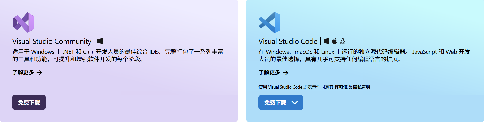
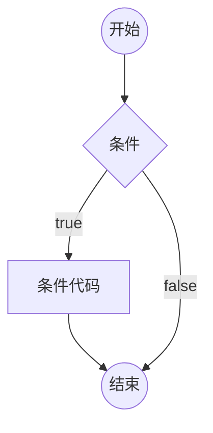
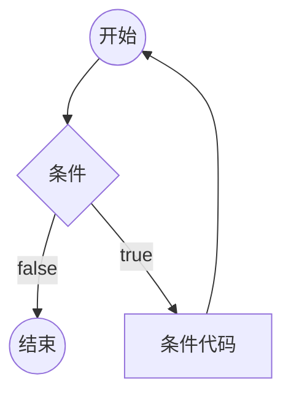

[菜鸟教程 - 学的不仅是技术，更是梦想！ (runoob.com)](https://www.runoob.com/)

[菜鸟教程在线编辑器 (runoob.com)](https://www.runoob.com/try/runcode.php?filename=helloworld&type=c)

CPrimer_Plus.6[Zh]_人邮社


[vs2022(Visual Studio 2022)权威指南&&C语言&&软件工程开发的方向&&技巧要领_哔哩哔哩_bilibili](https://www.bilibili.com/video/BV1Xt411g7jT/?spm_id_from=333.1387.upload.video_card.click&vd_source=b6cd6dd41c0769968f58ce886d249f74)

# 1.C语言开发环境配置

## 1.1.VS Code

**VSCode**是一个**文本编辑器**，配合**扩展**，可以方便的编辑代码

下载地址：[Visual Studio Code - Code Editing. Redefined](https://code.visualstudio.com/)

安装时勾选上”通过Code打开”操作添加到......上下文菜单“

使用“配置文件”为不同语言类型的项目创建配置文件，避免扩展发生冲突，新建配置文件，命名为“C/C++”

### 1.1.1.安装扩展

* Chinese(简体中文)：VScode中文环境包

* C/C++ Extension Pack

  其中，C/C++：IntelliSense 智能提示、debugging 调试、 code browsing 代码浏览

### 1.1.2.VS Code设置

常用设置——自动保存：onFocusChange

### 1.1.3.VS Code 常用快捷键

1、Ctrl+D：选择字符后，按 Ctrl+D，可同时选择下一个相同的字符，进行同时编辑

2、按住 alt 再按左键，可添加多个光标，进行多个位置同时编辑

3、alt+shift+上或下键，快速将该行代码复制到上一行或者下一行

4、Ctrl+F，查找替换

5、全局搜索，点击左侧搜索按钮，可以在打开的工作区搜索

6、菜单栏/运行/以非调试模式运行/启动调试

### 1.1.4.安装工具链

1、**编译器**：用来将代码文件生成计算机可执行的二进制文件

2、cmake：用来生成构建系统的工具，从而可以使用不同的编译器和工具链

​    下载地址：[Download CMake](https://cmake.org/download/)    ，下载：Binary distributions : Windows x64 ZIP

这里使用预先编译好的工具：[WinLibs - GCC+MinGW-w64 compiler for Windows](https://winlibs.com/)

包含GCC、G++、GDB、ninja、cmake等工具

​    下载：Win64 (without LLVM/Clang/LLD/LLDB)

解压缩到相应的目录，添加D:\_Tool_\C\MinGW-w64\bin 目录到系统环境变量中 **PATH** 

在终端中 (Win+R，输入cmd，确认) 验证工具 ( gcc、cmake、ninja) 的版本：`工具名 --version`

或者查看工具的目录：`where 工具名`

### 1.1.5.编码方式 Encoding

UTF-8 : 国际通用 (推荐使用)

Chinese BIG5 (Traditional) : 中文繁体

Chinese GB2312 (Simplified) : 中文简体

### 1.1.6.新建项目

1、在项目目录文件下新建main.c，并编辑main函数

2、在VScode资源管理器中左键选择main.c文件，按`F1`或者`Ctrl+Shift+P`，在`>`后输入`cmake`，选择`CMake:Quick Start`

3、输入新项目的名称：`project`，回车确定

4、选择创建`C`或者`C++`项目，回车确定

5、选择创建可执行文件`Executable`或者创建库`Library`，回车确定

6、选择其他选项，不需要则点击`确定`

7、选择要包含在CMakeLists.txt文件中的目标，选择`.c`源文件，点击`确定`

​    此时在VScode资源管理器中新增了`CMakeLists.txt`文件

````cmake
cmake_minimum_required(VERSION 3.10.0)    # cmake的最小版本需求(版本)
project(project VERSION 0.1.0 LANGUAGES C)    # 创建工程(项目名 版本 语言)

file(GLOB_RECURSE SOURCES ${CMAKE_CURRENT_SOURCE_DIR}/User/Src/*.c)
add_executable(project ${SOURCES})    #添加可执行文件(项目名 源文件)

# 添加头文件目录
include_directories(${CMAKE_CURRENT_SOURCE_DIR}/include)
````

8、选择cproj的配置预设(即选择编译器)，点击`添加新预设`，选择`从编译器创建`，选择`[扫描编译器]`

​    此时在VS code资源管理器中新增了`build`目录 (但是此时没有列出已安装的编译器，可能不是使用的GCC编译器创建的醒目)

9、删除`build`目录

10、重复第2步，会自动跳过中间的步骤，直接到第8步，选择`从编译器创建`后，此时会显示`GCC编译器`，选择

11、预设名称，可回车确定以默认名称

​    此时在VScode资源管理器中新增了`CMakePresets.json`文件、`out`目录

```cmake
{
    "version": 8,
    "configurePresets": [
        {
            "name": "GCC 8.1.0 x86_64-w64-mingw32",    // 预设名称
            "displayName": "GCC 8.1.0 x86_64-w64-mingw32",
            "description": "正在使用编译器: C = D:\\_Code_\\MinGW-w64\\bin\\gcc.exe, CXX = D:\\_Code_\\MinGW-w64\\bin\\g++.exe",
            "generator": "MinGW Makefiles",
            "binaryDir": "${sourceDir}/out/build/${presetName}",    // ${sourceDir}为项目目录；${presetName}为预设名称
            "cacheVariables": {
                "CMAKE_INSTALL_PREFIX": "${sourceDir}/out/install/${presetName}",
                "CMAKE_C_COMPILER": "D:/_Code_/MinGW-w64/bin/gcc.exe",
                "CMAKE_CXX_COMPILER": "D:/_Code_/MinGW-w64/bin/g++.exe",
                "CMAKE_BUILD_TYPE": "Debug"
            }
        }
    ]
}
```

12、生成项目：选择在VScode左侧的`CMake扩展`--项目--project(可执行文件)，点击右侧的`生成`

​    当`输出`中显示`[build] 生成完成`表示编译完成

​    在`out\build\预设名称`目录下生成`.exe`可执行文件

13、编译项目：选择第12步project(可执行文件)，右键点击--`在终端中运行`

​    此时进行`生成+运行`，合起来组成了编译过程

14、调试项目：打断点，选择第12步project(可执行文件)，右键点击--`调试`

* 或者在VScode左下方点击

    依次为`生成、调试、在终端中运行`

* 或者使用VScode自带的运行调试，需要配置好launch.json 文件和tasks.json 文件

15、清理项目：选择在VScode左侧的`CMake扩展`--项目，点击右侧的`生成`

​    将清理生成的`.exe`可执行文件

16、CMake Tools配置：

* cmake build输出内容中文乱码

  将cmake编码方式改为UTF-8：

  cmake tools设置--工作区的`cmake:Output Log Encoding`从`auto`改为`65001` (编码方式：UTF-8)，保存

  重新编译，中文显示正常

* VScode打开带有`CMakeLists.txt`的目录时，cmake tools会触发cmake configure，这是不必要的

  取消打开工程时触发cmake configure

  cmake tools设置--工作区的`cmake:configure on`，取消勾选On Edit和On Open，保存

此时在项目中生成`.vscode`目录，其中`settings.json`文件

```cmake
{
    "cmake.outputLogEncoding": "65001",
    "cmake.configureOnEdit": false,
    "cmake.configureOnOpen": false
}
```


## 1.2.Visual Studio 2022

下载地址：[免费的开发人员软件和服务 - Visual Studio](https://visualstudio.microsoft.com/zh-hans/free-developer-offers/)    选择Community社区版

工作负荷：桌面应用和移动应用--使用C++的桌面开发(MSVC)

单个组件：默认

语言包：默认

安装位置：建议默认    (建议C盘单独一个硬盘)

 

### 1.2.1.Visual Studio Installer

在“已安装”--VS版本，点击修改，重新选择工作负荷，可以添加其他语言开发环境

### 1.2.2.新建项目

1.创建新项目

选择“Windows桌面向导(使用向导自行创建Windows应用)”--下一步--设置项目名称、目录，勾选“将解决方案和项目放在同一目录中”--创建--应用程序类型：控制台应用程序，勾选“空项目”--确定

2.VS设置

工具--选项--环境--字体和颜色--字体设置为：Consolas  (VS Code常用字体)

工具--选项--文本编辑器--所有语言--常规--勾选“行号”

重置VS设置：工具--导入和导出设置向导--重置所有设置

拒绝访问错误：是权限出了问题。以管理员身份运行VS；杀毒软件；关闭BitLocker驱动器加密

如果编译出问题，先看“错误列表”和“输出”的信息

3.创建main.c

在解决方案资源管理器--源文件--右键添加--新建项--C++文件(.cpp)--重命名为(.c)--设置路径--添加

一个项目只能有一个main函数，是该项目程序的入口

4.开始执行(不调试)(Ctrl+F5)

看到[8-2.第二种方法：remove_哔哩哔哩_bilibili](https://www.bilibili.com/video/BV1Xt411g7jT?spm_id_from=333.788.player.switch&vd_source=b6cd6dd41c0769968f58ce886d249f74&p=12)


# 2、C 程序结构

使用C++源文件可编译C语言代码

 

## 输出 "Hello, World!"

```c
#include <stdio.h>    /*包含头文件*/

/* 主函数
   main:表示一个主函数
   return:表示函数的返回值
 */
int main()
{
   printf("Hello, World! \n"); 
   return 0;
}
```

## 主函数

所有C语言代码都有起始入口，即 主函数main

进入主函数后，才能由主函数调用其他函数

每个C语言代码，有且只能有一个主函数

1. 主函数被自动调用
2. 返回值给调用的程序
3. 主函数返回值必须为int

## 子函数

定义：将完成某一中功能的程序代码单独抽取出来形成一个模块，在其他函数中可随时调用此模块，以达到代码的**复用**和**优化程序结构**的目的

```c
void Function(unsigned char x,unsigned char y)
{
    
}

返回值类型 函数名(形参列表)
{
    函数体
}

/*void——空，无返回值 */
void function1(形参列表)
{
    函数体
}

/*int——整型，返回(整型)值 */
int function2(形参列表)
{
    函数体
    return 返回值;
}
```

## 函数

```c
返回值类型 函数名(输入参数)
{
  处理一些事情
  return 函数返回值;    
}
```

## C 程序的基本结构

预处理器指令：如 `#include` 和 `#define`

主函数：至少有一个 `main()` 函数，程序从这里开始执行

变量声明：声明程序中使用的变量

函数定义：定义程序中使用的函数

## 编译&执行 C 程序

调试代码，如果代码中没有错误，生成  .exe 可执行文件。

运行

## 标识符（Identifiers）

标识符是程序中变量、函数、数组等的名字。

由字母（大写或小写）、数字和下划线组成，但第一个字符必须是字母或下划线，不能是数字。

C 标识符内不允许出现标点字符，比如 @、$ 和 %。

C 是**区分大小写**的编程语言。

```
mohd       zara    abc   move_name  a_123
myname50   _temp   j     a23b9      retVal
```

## 常量（Constants）

常量是固定值，在程序执行期间不会改变。

常量可以是整型常量、浮点型常量、字符常量、枚举常量等。

```c
const int MAX = 100;  // 整型常量
const float PI = 3.14;  // 浮点型常量
const char NEWLINE = '\n';  // 字符常量
```

## 常用输出控制符表

| 控制符 | 说明                                                         |
| ------ | ------------------------------------------------------------ |
| %d     | 按十进制整型数据的实际长度输出                               |
| %ld    | 输出长整型数据                                               |
| %md    | m为指定的输出字段的宽度。如果数据的位数<m，则左端补以空格，如果>m，则按实际位数输出 |
| %c     | 输出字符                                                     |
| %s     | 输出字符串                                                   |
| %u     | 输出无符号整型（unsigned）                                   |
| %f     | 输出实数，包括单精度和双精度，以小数形式输出                 |
| %x     | 以十六进制形式输出整数                                       |

## 常用转义字符表

| 控制符 | 说明                                |
| ------ | ----------------------------------- |
| \r     | 回车，将当前位置移到本行开头        |
| \n     | 换行，将当前位置移到下一行          |
| \t     | 水平制表（HT）（跳到下一个TAB位置） |
| \ \    | 代表一个反斜线字符                  |
| \ '    | 代表一个单引号字符                  |
| \ "    | 代表一个双引号字符                  |
| \?     | 代表一个问号                        |
| \0     | 空字符（NUL）                       |

## 分隔符（Separators）

用于分隔语句和表达式，常见的分隔符包括：

* **逗号（,）**：用于分隔变量声明或函数参数。

* **分号（;）**：用于结束语句，每个语句必须以分号结束，它表明一个逻辑实体的结束。

  > 单独的分号也可以作为一个空语句，表示什么都不做。

* **括号**：

  * 圆括号（`()`）用于分组表达式、函数调用。
  * 花括号（`{}`）用于定义代码块。
  * 方括号（`[]`）用于数组下标。

## 关键字（Keywords）

C 中的保留字。不能作为常量名、变量名或其他标识符名称。

| **关键字** | **说明**                                                     |
| ---------- | ------------------------------------------------------------ |
| auto       | 声明自动变量                                                 |
| break      | 跳出当前循环                                                 |
| case       | 开关语句分支                                                 |
| char       | 声明字符型变量或函数返回值类型                               |
| const      | 定义常量，如果一个变量被 const 修饰，那么它的值就不能再被改变 |
| continue   | 结束当前循环，开始下一轮循环                                 |
| default    | 开关语句中的"其它"分支                                       |
| do         | 循环语句的循环体                                             |
| double     | 声明双精度浮点型变量或函数返回值类型                         |
| else       | 条件语句否定分支（与 if 连用）                               |
| enum       | 声明枚举类型                                                 |
| extern     | 声明变量或函数是在其它文件或本文件的其他位置定义             |
| float      | 声明浮点型变量或函数返回值类型                               |
| for        | 一种循环语句                                                 |
| goto       | 无条件跳转语句                                               |
| if         | 条件语句                                                     |
| int        | 声明整型变量或函数                                           |
| long       | 声明长整型变量或函数返回值类型                               |
| register   | 声明寄存器变量                                               |
| return     | 子程序返回语句（可以带参数，也可不带参数）                   |
| short      | 声明短整型变量或函数                                         |
| signed     | 声明有符号类型变量或函数                                     |
| sizeof     | 计算数据类型或变量长度（即所占字节数）                       |
| static     | 声明静态变量                                                 |
| struct     | 声明结构体类型                                               |
| switch     | 用于开关语句                                                 |
| typedef    | 用以给数据类型取别名                                         |
| unsigned   | 声明无符号类型变量或函数                                     |
| union      | 声明共用体类型                                               |
| void       | 声明函数无返回值或无参数，声明无类型指针                     |
| volatile   | 说明变量在程序执行中可被隐含地改变                           |
| while      | 循环语句的循环条件                                           |

C99 新增关键字

|       |          |            |        |          |
| ----- | -------- | ---------- | ------ | -------- |
| _Bool | _Complex | _Imaginary | inline | restrict |

C11 新增关键字

| _Alignas       | _Alignof      | _Atomic | _Generic | _Noreturn |
| -------------- | ------------- | ------- | -------- | --------- |
| _Static_assert | _Thread_local |         |          |           |

## C 中的空格

只包含空格的行，被称为空白行，可能带有注释，C 编译器会完全忽略它。

空格用于描述空白符、制表符、换行符和注释。分隔语句的各个部分，让编译器能识别语句中的某个元素（比如 int）在哪里结束，下一个元素在哪里开始。

```c
int age;
```

为了增强可读性，可以根据需要适当增加一些空格。

```c
fruit = apples + oranges;   // 获取水果的总数
```

## 注释

以 **//** 开始的单行注释，可单独占一行。

```c
// 单行注释
```

以**/\* \*/** ，可以单行或多行。

```c
/* 单行注释 */
```

```c
/* 
 多行注释
 多行注释
 多行注释
 */
```

不能在注释内嵌套注释，注释也不能出现在字符串或字符值中。

## 局部变量、静态局部变量、全局变量与静态全局变量

作用域：起作用的区域，也就是可以工作的范围

代码块：用{}括起来的一段代码

数据段：数据段存的是数，像全局变量就是存在数据段的

代码段：存的是程序代码，一般是只读的

栈(stack)：先进后出。C语言中局部变量就分配在栈中


### 局部变量

定义在函数内部

**普通局部变量**，定义时直接定义或在变量名前加**auto**关键字来标识

​    在调用时，会定义一个新的变量，若未初始化，则值是随机的，结束调用同时杀死本次定义的这个变量，这就是局部变量的整个生命周期。

**静态局部变量**，定义时在变量名前加**static**关键字来标识

    1. 在第一次被调用时定义并初始化，结束调用时它不被杀死，而是保持其值等待下一次被调用。下次调用时不再重新创造和初始化该变量，而是直接用上一次留下的值。
    2. 静态局部变量的这种特性，和全局变量非常类似。相同点是都定义和初始化一次，以后调用时值保持上次的不变。不同点在于作用域不同。


### 全局变量

定义在函数外部

**普通全局变量**，定义时直接定义。可以在各个文件中使用，可以在项目内别的.c文件中被看到，要确保不能重名。

**静态全局变量**，定义时在变量名前加**static**关键字来标识，用来解决重名问题的。 告诉编译器这个变量只在当前文件内使用，在别的文件中绝对不会使用。这样就不用担心重名问题。

**外部全局变量** ，定义时在变量名前加**extern**关键字来标识，在一个程序的一个.c文件中被定义，在该程序的其他.c文件中被调用（调用前需声明）。

    在 文件1中 定义了一个全局变量：
    int a = 5;
    
    /*******************************************************************************************************/
    
    要在同一项目的 文件2 中调用，需先声明：
    extern int a;
      此时编译器就知道a是一个已在其他地方定义的变量，会自动在本文件或其他文件中搜寻。
      声明后，即可在 文件2 中对变量操作

函数和全局变量在C语言中可以跨文件引用，用 extern 来声明


### 局部变量和全局变量的对比

1. **若定义同时没有初始化，则局部变量的值是随机的，而全局变量的值是默认为0**
2. 使用范围上：全局变量具有文件作用域，而局部变量只有代码块作用域
3. 生命周期上：全局变量是在程序开始运行之前的初始化阶段就诞生，到整个程序结束退出的时候才死亡；而局部变量在进入局部变量所在的代码块时诞生，在该代码块退出的时候死亡
4. 变量分配位置：全局变量分配在数据段上，而局部变量分配在栈上

## 数的进制转换

### 二进制、十进制、十六进制

| 二进制    | 十进制 | 十六进制 |
| --------- | ------ | -------- |
| 0000 0000 | 0      | 0        |
| 0000 0001 | 1      | 1        |
| 0000 0010 | 2      | 2        |
| 0000 0011 | 3      | 3        |
| 0000 0100 | 4      | 4        |
| 0000 0101 | 5      | 5        |
| 0000 0110 | 6      | 6        |
| 0000 0111 | 7      | 7        |
| 0000 1000 | 8      | 8        |
| 0000 1001 | 9      | 9        |
| 0000 1010 | 10     | A        |
| 0000 1011 | 11     | B        |
| 0000 1100 | 12     | C        |
| 0000 1101 | 13     | D        |
| 0000 1110 | 14     | E        |
| 0000 1111 | 15     | F        |
| 0001 0000 | 16     | 10       |

* 二进制用 B 表示
* 十六进制用 H 表示，是二进制的简短表示形式，在 C语言 中用`0x`前缀表示后面的数为十六进制


### 二进制转换为十进制：

先写出 二进制 每位的位权，再将为1的位的位权相加

|      | 二进制            | 十进制              |
| ---- | ----------------- | ------------------- |
| 位权 | $2^2$ $2^1$ $2^0$ |                     |
| 值   | 000               | 0                   |
| 值   | 001               | $1*2^0 = 1$         |
| 值   | 101               | $1*2^2+0+1*2^0 = 5$ |


### 二进制转换为十六进制：

规律：一般把四个二进制数放在一起转换成一个十六进制数，转换时先把二进制数转换成十进制数，再把十进制数转换成十六进制数

| 二进制B   | 十进制 | 十六进制H |
| --------- | ------ | --------- |
| 0001      | 1      | 1         |
| 1001      | 9      | 9         |
| 1010      | 10     | A         |
| 0010 1100 | 44     | 2C        |


### BCD码

* BCD码（Binary Coded Decimal‎），用4位二进制数来表示1位十进制数

  例：0001 0011表示13，1000 0101表示85，0001 1010不合法

* 在十六进制中的体现：0x13表示13，0x85表示85，0x1A不合法

* BCD码转十进制

  DEC=BCD/16*10+BCD%16; （2位BCD）

* 十进制转BCD码

  BCD=DEC/10*16+DEC%10; （2位BCD）

## 字符串字面量（String Literals）

字符串字面量是由双引号括起来的字符序列。

字符串末尾会自动添加一个空字符 **\0**。

```c
char greeting[] = "Hello, World!";
```


# 3、C 数据类型


在 C 语言中，数据类型指的是用于声明不同类型的变量或函数的一个广泛的系统。变量的类型决定了变量存储占用的空间，以及如何解释存储的位模式。


## 基本数据类型

是算术类型，包括整型（int）、字符型（char）、浮点型（float）和双精度浮点型（double）

 整数类型：

| 类型   | 符号 | 关键字         | 存储大小              | 值范围                                               |
| ------ | ---- | :------------- | :-------------------- | :--------------------------------------------------- |
| 整型   | 有   | (signed) int   | 2 或 4 字节(16或32位) | -32,768 到 32,767 或 -2,147,483,648 到 2,147,483,647 |
| 整型   | 有   | (signed) short | 2 字节(16位)          | -32,768 到 32,767                                    |
| 整型   | 有   | (signed) long  | 4 字节(32位)          | -2,147,483,648 到 2,147,483,647                      |
| 整型   | 无   | unsigned int   | 2 或 4 字节(16或32位) | 0 到 65,535 或 0 到 4,294,967,295                    |
| 整型   | 无   | unsigned short | 2 字节(16位)          | 0 到 65,535                                          |
| 整型   | 无   | unsigned long  | 4 字节(32位)          | 0 到 4,294,967,295                                   |
| 字符型 | 有   | (signed) char  | 1 字节(8位)           | -128 到 127 或 0 到 255                              |
| 字符型 | 无   | unsigned char  | 1 字节(8位)           | 0 到 255                                             |

实型/浮点型

| 类型   | 符号 | 关键字      | 存储大小       | 值范围                 | 精度        |
| ------ | ---- | :---------- | :------------- | :--------------------- | ----------- |
| 浮点型 | 有   | float       | 4 字节(32位)   | 1.2E-38 到 3.4E+38     | 6 位有效位  |
| 浮点型 | 有   | double      | 8 字节(64位)   | 2.3E-308 到 1.7E+308   | 15 位有效位 |
| 浮点型 | 有   | long double | 16 字节(128位) | 3.4E-4932 到 1.1E+4932 | 19 位有效位 |


## 枚举类型

也是算术类型，被用来定义在程序中只能赋予其一定的离散整数值的变量


## void 类型

表示没有值的数据类型，通常用于函数返回值


## 派生类型

包括数组类型、指针类型和结构体类型


## 单片机数据类型

| 关键字             | 位数 | 表示范围                 | stdint关键字 | ST关键字 |
| ------------------ | ---- | ------------------------ | ------------ | -------- |
| char               | 8    | -128 ~ 127               | int8_t       | s8       |
| unsigned char      | 8    | 0 ~ 255                  | uint8_t      | u8       |
| short              | 16   | -32768 ~ 32767           | int16_t      | s16      |
| unsigned short     | 16   | 0 ~ 65535                | uint16_t     | u16      |
| int                | 32   | -2147483648 ~ 2147483647 | int32_t      | s32      |
| unsigned int       | 32   | 0 ~ 4294967295           | uint32_t     | u32      |
| long               | 32   | -2147483648 ~ 2147483647 |              |          |
| unsigned long      | 32   | 0 ~ 4294967295           |              |          |
| long long          | 64   | -(2^64)/2 ~ (2^64)/2-1   | int64_t      |          |
| unsigned long long | 64   | 0 ~ (2^64)-1             | uint64_t     |          |
| float              | 32   | -3.4e38 ~ 3.4e38         |              |          |
| double             | 64   | -1.7e308 ~ 1.7e308       |              |          |

# 4、判断





## if判断语句

```
if (逻辑表达式)
{
	语句体1
}
else
{
	语句体2
}
```

若逻辑表达式为真，执行语句体1，否则，执行语句体2. else可不要


## switch判断语句

```
switch (变量)
{
	case 常量1 : 语句体1; break;
	case 常量2 : 语句体2; break;
	default: 语句体3; break;
}
```

将变量与case后的各个常量对比，若相等，则执行相应的语句体，否则，执行default后的语句体。default可不要

# 5、循环





## for循环语句

```
for (初始化；逻辑表达式；更改条件)
{
	循环体;
}
```

先执行初始化，再判断逻辑表达式，若成立，则执行循环体，再更改条件，再判断逻辑表达式，直到表达式不成立


## while循环语句

```
while (逻辑表达式)
{
	循环体;
}
```

若逻辑表达式成立，则执行循环体，再判断逻辑表达式，直到表达式不成立


## do...while循环语句

```
do {
	循环体;
} while(逻辑表达式)
```

先执行循环体，再判断逻辑表达式，直到表达式不成立


## 无限循环语句

```
//for无限循环
for (;;)
{
	循环体;
}

//while无限循环
while(1)
{
	循环体;
}
```


## 循环控制语句

改变代码的执行顺序。可以实现代码的跳转

### break语句

1. 在循环内，立即终止循环，且程序流将继续执行紧接着循环的下一条语句。
2. 在switch语句case内，终止该case，且程序流将继续执行紧接着该case的下一条语句。


### continue语句

跳过当前循环体，重新开始下一次循环迭代

* 对for循环，continue语句执行后自增语句仍然会执行
* 对while和do...while循环，continue语句重新执行判断条件语句

 

# 6、运算符（Operators）

 


用于执行各种操作，如算术运算、逻辑运算、比较运算等。

## 算术运算符

A=21, B=10, C

| 运算符   | 功能               | 实列                           |
| -------- | ------------------ | ------------------------------ |
| 加`+`    | 将两数相加         | C=A+B=31                       |
| 减`-`    | 将两数相减         | C=A-B=11                       |
| 乘`*`    | 将两数相乘         | C=A*B=210                      |
| 除`/`    | 分子除以分母       | C=A/B=2 (整数型不显示小数)     |
| 取余`%`  | 取模，整除后的余数 | C=A%B=1                        |
| 自增`++` | 将数加1            | C=A++ =21, A=22 (先赋值再运算) |
| 自减`--` | 将数减1            | C=--A =20, A=20 (先运算再赋值) |


## 关系运算符

A=1, B=0

| 运算符       | 功能                                           | 实例        |
| ------------ | ---------------------------------------------- | ----------- |
| 等于`==`     | 判断两数是否相等，是则为真，否则为假           | (A==B) 为假 |
| 不等于`!=`   | 判断两数是否不相等，是则为真，否则为假         | (A!=B) 为真 |
| 大于`>`      | 判断左数是否大于右数，是则为真，否则为假       | (A>B) 为真  |
| 大于等于`>=` | 判断左数是否大于或等于右数，是则为真，否则为假 | (A>=B) 为真 |
| 小于`<`      | 判断左数是否小于右数，是则为真，否则为假       | (A<B) 为假  |
| 小于等于`<=` | 判断左数是否小于或等于右数，是则为真，否则为假 | (A<=B) 为假 |


## 逻辑运算符

A=1, B=0

| 运算符     | 功能                                       | 实例         |
| ---------- | ------------------------------------------ | ------------ |
| 逻辑与`&&` | 若两数都非零，则为真                       | (A&&B)为假   |
| 逻辑或`||` | 若两数中有任意一个非零，则为真             | (A\|\|B)为真 |
| 逻辑非`!`  | 逆转数的逻辑状态，若条件为真，则逻辑非为假 | !(A&&B)为真  |


## 位运算符

A=0011 1100  (60) , 

B=0000 1101  (13)

| 运算符       | 功能                                                         | 实例                      |
| ------------ | ------------------------------------------------------------ | ------------------------- |
| 按位与`&`    | 对两数的每一位执行逻辑与，若两位都非零，则该位为1，否则为0   | (A&B)=0000 1100  (12)     |
| 按位或`|`    | 对两数的每一位执行逻辑或，若两位都为零，则该位为0，否则为1   | (A\|B)=0011 1101  (61)    |
| 按位异或`^`  | 对两数的每一位执行逻辑异或，若两位的值相同，则该位为0，否则为1 | (A^B)=0011 0001  (49)     |
| 按位取反`~`  | 对数的每一位执行逻辑非，若位的值为非零，则该位为0，若位的值为0，则该位为1 | (~A)=-1100 0011  (-61)??? |
| 按位左移`<<` | 将数的所有位向左移动指定的位数，左移n位相当于乘以$2^n$ ，(左边的二进制位丢弃，右边补0)。 | A<<2=1111 0000  (240)     |
| 按位右移`>>` | 将数的所有位向右移动指定的位数，右移n位相当于除以$2^n$ ，(右边的二进制位丢弃，正数左补0，负数左补1)。 | A>>2=0000 1111  (15)      |


### 与或式赋值法

在不改变其他位的值的情况下，对某几个位进行赋值

先对需要设置的位用&操作符进行清零操作，然后用|操作符设值

```c
如有一个数                1010 0011
先对其与上0xf0 :          1111 0000  //高四位保持不变，低四位清零 (任何一个数与上1仍为其本身，与上0则为0)
1010 0011 & 1111 0000 = 1010 0000
再对其或上需赋的值0x01      0000 0001 //高四位保持不变，低四位赋值 (任何一个数或上0还为其本身，或上1则为1)
1010 0000 | 0000 0001 = 1010 0001
```


### 移位操作

提高代码的可读性

```c
如给某寄存器的第1位赋值1
  SysTick->CTRL |= 1 << 1;    // SysTick->CTRL = SysTick->CTRL | 1; SysTick->CTRL = SysTick->CTRL << 1;
  0000 0000 —— 0000 00001 —— 0000 0010
```


## 赋值运算符

| 运算符             | 功能                         | 实例                      |
| ------------------ | ---------------------------- | ------------------------- |
| 赋值`=`            | 将右边赋值给左边             | C=A+B  将A+B 赋值给C      |
| 加且赋值`+=`       | 把右数加上左数，再赋值给左数 | C+=A相当于C=C+A           |
| 减且赋值`-=`       | 把左数减去右数，再赋值给左数 | C-=A相当于C=C-A           |
| 乘且赋值`*=`       | 把右数乘以左数，再赋值给左数 | C\*=A相当于C=C\*A         |
| 除且赋值`/=`       | 把左数除以右数，再赋值给左数 | C/=A相当于C=C/A           |
| 求模且赋值`%=`     | 求两数的模，再赋值给左数     | C%=A相当于C=C%A           |
| 左移且赋值`<<=`    |                              | C <<= 2 等同于 C = C << 2 |
| 右移且赋值`>>=`    |                              | C >>= 2 等同于 C = C >> 2 |
| 按位与且赋值`&=`   |                              | C &= 2 等同于 C = C & 2   |
| 按位或且赋值`|=`   |                              | C\|=2等同于C=C\|2         |
| 按位异或且赋值`^=` |                              | C ^= 2 等同于 C = C ^ 2   |


## 其他运算符

int a=4;

| 运算符   | 功能                          | 实例                                                         |
| -------- | ----------------------------- | ------------------------------------------------------------ |
| `sizeof` | 返回变量的大小                | sizeof(a) 将返回 4，其中 a 是整数                            |
| `?:`     | 三元运算符，可替代`if...else` | `(condition)? true:false`  (condition为真，则返回true，否则返回false) |
| `&`      | 返回变量的地址                | &a; 将给出变量的实际地址                                     |
| `*`      | 指向一个变量                  | *a; 将指向一个变量                                           |
| `->`     |                               |                                                              |
| `.`      |                               |                                                              |


## 运算符优先级

按运算符优先级从高到低列出各个运算符，具有较高优先级的运算符出现在表格的上面，具有较低优先级的运算符出现在表格的下面。

在表达式中，较高优先级的运算符会优先被计算。

| 类别       | 运算符                            | 结合性   |
| :--------- | :-------------------------------- | :------- |
| 后缀       | () [] -> . ++ - -                 | 从左到右 |
| 一元       | + - ! ~ ++ - - (type)* & sizeof   | 从右到左 |
| 乘除       | * / %                             | 从左到右 |
| 加减       | + -                               | 从左到右 |
| 移位       | << >>                             | 从左到右 |
| 关系       | < <= > >=                         | 从左到右 |
| 相等       | == !=                             | 从左到右 |
| 位与 AND   | &                                 | 从左到右 |
| 位异或 XOR | ^                                 | 从左到右 |
| 位或 OR    | \|                                | 从左到右 |
| 逻辑与 AND | &&                                | 从左到右 |
| 逻辑或 OR  | \|\|                              | 从左到右 |
| 条件       | ?:                                | 从右到左 |
| 赋值       | = += -= *= /= %=>>= <<= &= ^= \|= | 从右到左 |
| 逗号       | ,                                 | 从左到右 |

# 7.指针与数组

参考：[[C语言\] 指针的详解与应用-理论结合实践，真正理解指针！](https://www.bilibili.com/video/BV1Mb4y1X7dz/?spm_id_from=333.1387.upload.video_card.click&vd_source=b6cd6dd41c0769968f58ce886d249f74)

指针(Pointer)：与底层硬件联系紧密，使用指针可操作数据的地址，实现数据的间接访问

## 7.1.计算机存储机制

定义变量：int a = 0x12345678;

​            short b = 0x5A6B;

​            char c[] = {0x33, 0x34, 0x35};

​            short d[] = {0x1A2B, 0x3C4D};

分析：数据类型int代表4个字节的整型，1个字节有8位二进制数，共4*8=32位二进制数，小端分配模式

​                数据类型short代表2个字节的短整型，小端分配模式(把数据的小端存储在内存的低位(前面))

​                数组类型char代表1个字节的数组，连续分配模式

​                数组类型short代表2个字节的数组，每个数用小端分配模式，数组元素用连续分配模式

内存分配的逻辑：int a 、short b 、char c[]、shortd[]

| 地址   | 内存 |      |
| ------ | ---- | ---- |
| 0x4000 | 0x78 | a    |
| 0x4001 | 0x56 |      |
| 0x4002 | 0x34 |      |
| 0x4003 | 0x12 |      |
| 0x4004 | 0x6B | b    |
| 0x4005 | 0x5A |      |
| 0x4006 | 0x33 | c    |
| 0x4007 | 0x34 |      |
| 0x4008 | 0x35 |      |
| 0x4009 | 0x2B | d    |
| 0x400A | 0x1A |      |
| 0x400B | 0x4D |      |
| 0x400C | 0x3C |      |


## 定义指针

指针即指针变量，用于存放其他数据单元（变量/数组/结构体/函数等）的首地址。

若指针存放了某个数据单元的首地址，则这个指针指向了这个数据单元

若指针存放的值是0，则这个指针为空指针


定义一个指针变量：

| 数据类型         |       | 指向该数据类型的指针 |       |
| ---------------- | ----- | -------------------- | ----- |
| (unsigned) char  | 1字节 | (unsigned) char *    | x字节 |
| (unsigned) short | 2字节 | (unsigned) short *   | x字节 |
| (unsigned) int   | 4字节 | (unsigned) int *     | x字节 |
| (unsigned) long  | 4字节 | (unsigned) long *    | x字节 |
| float            | 4字节 | float *              | x字节 |
| double           | 8字节 | double *             | x字节 |

16位系统：x=2，32位系统：x=4，64位系统：x=8

**指针变量的位宽与系统的位宽一致。**


## 指针的操作

| 操作方式 | 举例   | 解释                          |
| -------- | ------ | ----------------------------- |
| 取地址   | p=&a;  | 将数据a的首地址赋值给指针p    |
| 取内容   | *p;    | 取出指针p指向的数据单元       |
| 加       | p++;   | 使指针向下移动1个**数据宽度** |
|          | p=p+5; | 使指针向下移动5个**数据宽度** |
| 减       | p--;   | 使指针向上移动1个**数据宽度** |
|          | p=p-5; | 使指针向上移动5个**数据宽度** |


```c
#include <stdio.h>

int main(void) {
    char a = 0x66;    //定义一个int型的数据
    char *p;    //定义一个指向int型数据的指针

    p = &a;    //将数据a的首地址赋值给指针p  可在定义时初始化：char *p = &a;
    
    printf("%x\n",a);    //66
    printf("%x\n",p);    //4000 （地址不一定是改值，可能是硬件内存中的任意地址）
    printf("%x\n",*p);    //66
    
    return 0;
}

```


| 地址   | 内存 |      |
| ------ | ---- | ---- |
| 0x4000 | 0x66 | a    |
| 0x4001 | 0x00 | p    |
| 0x4002 | 0x40 |      |
| 0x4003 |      |      |
| 0x4004 |      |      |


程序先编译 指针p 的数据所指向的地址，再去该地址下读取存储的数据


## 注意事项

* 在对指针取内容之前，一定要确保指针指在了合法的位置，否则将会导致程序出现不可预知的错误
* 同级指针之间才能相互赋值，跨级赋值将会导致编译器报错或警告


```c
#include <stdio.h>

int main(void) {
    char a = 0x66;    //定义一个int型的数据
    char *p;    //定义一个指向int型数据的指针

    a = p;    //报错，p是指针，a是整型变量
    a = *p;    //合理，*p是指针取内容
    p = &a;    //合理，&a是取地址，将数据a的首地址赋值给指针p  可在定义时初始化：char *p = &a;
    
    return 0;
}

```


## 数组

数组是一些相同数据类型的变量组成的集合，其数组名即为指向该数据类型的指针。

* 数组的定义等效于申请内存、定义指针和初始化。
  定义数组：char c[] = {0x33, 0x34, 0x35};
  等效于：申请内存
                  定义 char *c = 0x4000;

  ​                初始化数组数据

* 利用数组名+下标(索引号)引用数组数据 等效于 指针取内容
      c[0];  等效于 *c;
      c[1];  等效于 *(c+1);
      c[2];  等效于 *(c+2);


```c
int x[3]; //定义一组变量(3个)
int x[]={1,2,3}; //或者定义一组变量并初始化

x[0] //引用数组的第0位变量
x[1] //引用数组的第1位变量
x[2] //引用数组的第2位变量
引用 x[3] 时，数组越界，读出的数值不确定，应避免这种操作
```


| 地址   | 内存 |      |
| ------ | ---- | ---- |
| 0x4000 | 0x33 | c    |
| 0x4001 | 0x34 |      |
| 0x4002 | 0x35 |      |


```c
#include <stdio.h>
#include <stdlib.h>

int main(void) {
    char a[] = {0x33, 0x34, 0x35};    //定义一个char型的数组
  
    /* 等效于
      //定义指针
    int *a;
      //申请内存
    a = malloc(3*4);
      //初始化数组数据
    *a = 0x33;
    *(a+1) = 0x34;
    *(a+2) = 0x35;
    */
  
    char *p;    //定义一个指向char型数组的指针

    p = a;
    
    printf("a[0]=%x\n",a[0]);    //33
    printf("a[1]=%x\n",a[1]);    //34
    printf("a[2]=%x\n",a[2]);    //35
    
    printf("*p=%x\n",*p);    //33
    printf("*(p+1)=%x\n",*(p+1));    //34
    printf("*(p+2)=%x\n",*(p+2));    //35
    
    return 0;
}

```


## 指针的应用

### 传递参数

* 使用指针传递大容量的参数，主函数和子函数使用的是同一套数据，避免了参数传递过程中的数据复制，提高了运行效率，减少了内存占用

1. **值传递**

   ```c
   #include <stdio.h>
   
   void fun(int param) {
       printf("%x\n",param);
   }
   
   int main(void) {
       int a = 0x66;
       
       fun(a);    //66
       
       return 0;
   }
   
   ```

   执行主函数，先为int a 申请内存并初始化0x66，再调用子函数void fun(int param)，将 a 的数据复制给局部变量 param ，执行子函数

   | 地址 | 内存 |       |
   | ---- | ---- | ----- |
   |      | 0x66 | a     |
   |      | 0x66 | param |

   优点：**隔离主函数、子函数的数据，防止出现安全问题**，主函数中的数据不会被子函数改变

   缺点：对于传递大容量的参数，使用值传递，复制过程，浪费时间、内存

   

2. **指针传递**

   ```c
   #include <stdio.h>
   
   /**
     * 函数：寻找一个数组最大值
     * 参数：数组的指针
     * 参数：数组的数据个数
     * 返回值：数组的最大值
     */
   void FindMax(int *array,int Count) {
       int i;
       int max = array[0];
       for(i = 1; i < Count; i ++) {
           if(array[i] > max) {
               max = array[i];
           }
       }
       return max;
   }
   
   int main(void) {
       int a[] = {1,2,3,5,4,3};
       int Max;
     
       Max = FindMax(a,6);
     
       printf("Max=%d\n",Max);  //5
       
       return 0;
   }
   
   ```

   执行主函数，先为int a[] 申请内存并初始化{1,2,3,5,4,3}，再为 int Max申请内存，再调用子函数void FindMax(int *array,int Count)，将 数组a 的指针给局部变量 指针array，(将数组a 的个数数据 给 局部变量Count，此为值传递，先不分析)，执行子函数并将其返回值给 Max，实现指针间接访问参数

   | 地址         | 内存                                 |      |
   | ------------ | ------------------------------------ | ---- |
   | 数组a 的指针 | 1                                    | a    |
   |              | 2                                    |      |
   |              | 3                                    |      |
   |              | 5                                    |      |
   |              | 4                                    |      |
   |              | 3                                    |      |
   |              | 将 数组a 的指针给 子函数并得到返回值 | Max  |

   若子函数改变了主函数的数据：

   ```c
   #include <stdio.h>
   
   void FindMax(int *array,int Count) {
       int max = array[0];
       array[1] = 0x66;    //对传入的指针第1位数据进行赋值
       return max;
   }
   
   int main(void) {
       int a[] = {1,2,3,5,4,3};
       int Max;
     
       Max = FindMax(a,6);
     
       printf("Max=%d\n",Max);    //1
       printf("a[1]=%d\n",a[1]);    //66 ，主函数中的数据 a[1] = 2 ，经过此子函数的操作变为66
       
       return 0;
   }
   
   ```

   为防止改变主函数的数据，应该对传递的指针用 **const  (表示常量，传入子函数的数据只能被读取，不能被写入，否则报错)**

   ```c
   #include <stdio.h>
   
   void FindMax(const int *array,int Count) {
       int max = array[0];
       array[1] = 0x66;    //对传入的指针第1位数据进行赋值
       return max;
   }
   
   int main(void) {
       int a[] = {1,2,3,5,4,3};
       int Max;
     
       Max = FindMax(a,6);    //程序执行到此处会报错，因为此处子函数尝试对其中只读的数据进行写入
     
       printf("Max=%d\n",Max);
       printf("a[1]=%d\n",a[1]);
       
       return 0;
   }
   
   ```


* 使用指针传递输出参数，利用主函数和子函数使用同一套数据的特性，实现数据的返回，可实现多返回值函数的设计
  传入子函数的数据被读取，也被写入

  ```c
  #include <stdio.h>
  
  /**
    * 函数：寻找一个数组最大值和出现次数
    * 参数：最大值指针
    * 参数：最大值出现次数指针
    * 参数：数组的指针
    * 参数：数组的数据个数
    * 返回值：无
    */
  void FindMaxNum(int *max, int *num, const int *array,int Count) {
      int i;
      *max = array[0];    //*max是指针取内容，
      *num = 1;
      for(i = 1; i < Count; i ++) {
          if(array[i] > *max) {
              *max = array[i];
              *num = 1;
          }
          else if(array[i] == *max) {
              (*num) ++;
          }
      }
  }
  
  int main(void) {
      int a[] = {1,2,3,5,4,3};
      int Max;
      int Num;
    
      //&Max是变量取地址(指针)，给到子函数中参数指针max，Max与*max是同一个数据，&Num同理
      FindMaxNum(&Max, &Num, a, 6);
    
      printf("Max=%d\n",Max);  //5
      printf("Num=%d\n",Num);  //1
      
      return 0;
  }
  
  ```

  执行主函数，先为 数组a 申请内存并初始化，为 Max、Num 申请内存，再调用子函数void FindMaxNum(int *max, int *num, int *array,int Count)，将Max的地址(指针)、Num的地址(指针)、数组的地址、数组的数据个数 传给并执行子函数

  分析Max：

  | 地址     | 内存           |         |
  | -------- | -------------- | ------- |
  | &Max指针 | *max指针取内容 | Max     |
  |          | &Max指针       | max指针 |


### 传递返回值

将模块内的公有部分返回，让主函数持有模块的“句柄”，便于程序对指定对象的操作

```c
#include <stdio.h>

/*********************/
int Time[] = {23, 59, 55};    // 模块内的公有部分


int *GetTime(void) {    // 返回值的类型为 int *
    return Time;
}
/*********************/

int main(void) {
    int *pt;
  
    pt = GetTime();    //主函数持有模块的“句柄”
  
    printf("pt[0]=%d\n",pt[0]);  //23
    printf("pt[1]=%d\n",pt[1]);  //59
    printf("pt[2]=%d\n",pt[2]);  //55
    
    return 0;
}

```

注意不要将局部变量的指针作为返回值，因为局部变量会在调用完子函数后销毁，所以此时返回值为无效的地址


```c
#include <stdio.h>

int main(void) {
    
    // 对文件进行写入
    FILE *f = fopen("D:\\test.txt", "w");  //以写入模式打开 路径下的文件
    fputc('a', f);
    fputs('Hello Word!', f);
    fclose(f);
  
    /*
    //对文件进行读取
    char a;
    char s[10];
    
    FILE *f = fopen("D:\\test.txt", "r");  //以读取模式打开 路径下的文件
    a = fgetc(f);
    fgets(s,15,f);
    fclose(f);
    
    printf("%c",a);    //a
    printf(s);    //aHello Word! （结尾有一个空格）
    */
  
    return 0;
}

```


### 直接访问物理地址下的数据(单片机)

* 访问（读/写）硬件指定内存下的数据，如设备ID号等
  作用：1、加密，将程序指定设备可用；2、网络通信，使用设备ID构建通信双方的唯一地址来标识。

  ​            通过写入操作，还可实现程序的更新

  在51单片机中读取ID

  ```c
  #include <REGX52.h>
  #include "LCD1602.h"
  
  void main() {
      LCD_Init();
      
      /*读取单片机内部RAM的F1H~F7H单元的内容的内容，即全球唯一ID号*/
      unsigned char *p;
      p = (unsigned char *)0xF1
        
      LCD_ShowHexNum(1,1,*p,2);    // *p 也可写成 *((unsigned char *)0xF1)
      LCD_ShowHexNum(1,3,*(p+1),2);
      LCD_ShowHexNum(1,5,*(p+2),2);
      LCD_ShowHexNum(1,7,*(p+3),2);
      LCD_ShowHexNum(1,9,*(p+4),2);
      LCD_ShowHexNum(1,11,*(p+5),2);
      LCD_ShowHexNum(1,13,*(p+6),2);
    
      /*读取单片机程序存储器的最后7个字节单元的内容，即全球唯一ID号*/
      unsigned char code *t;
      t = (unsigned char code *)0x1FF9
        
      LCD_ShowHexNum(2,1,*t,2);    // *t 也可写成 *((unsigned char code *)0x1FF9)
      LCD_ShowHexNum(2,3,*(t+1),2);
      LCD_ShowHexNum(2,5,*(t+2),2);
      LCD_ShowHexNum(2,7,*(t+3),2);
      LCD_ShowHexNum(2,9,*(t+4),2);
      LCD_ShowHexNum(2,11,*(t+5),2);
      LCD_ShowHexNum(2,13,*(t+6),2);
    
      while(1) {
          
      }
  }
  
  ```

  

* 将复杂格式的数据转换为字节，方便通信与存储

  ```c
  #include <stdio.h>
  
  /*********************************/
  unsigned char AirData[20];
  
  void SendData(const unsigned char *data, unsigned char count) {
      unsigned char i;
      for(i = 0; i < count; i ++) {
          AirData[i] = data[i];
      }
  }
  
  void GetData(unsigned char *data, unsigned char count) {
      unsigned char i;
      for(i = 0; i < count; i ++) {
          data[i] = AirData[i];
      }
  }
  
  /*********************************/
  
  int main(void) {
      unsigned char i;
      
      /*发送字节*/
      unsigned char DataSend[] = {0x12, 0x34, 0x56, 0x78};
    
      SendData(DataSend,4);
    
      printf("\nAirData=");
      for(i = 0; i < 20; i ++) {
          printf("%x ",AirData[i]);
      }
      
      /*接受字节*/
      unsigned char DataGet[4];
    
      GetData(DataGet,4)
        
      printf("\nDataGet=");
      for(i = 0; i < 4; i ++) {
          printf("%x ",DataGet[i]);
      }
    
      //发送复杂格式的数据
      float num = 12.345;
    
      unsigned char *p;
    
      p = (unsigned char *)&num;    //将复杂格式的数据当作字节
    
      SendData(p,4);
    
      printf("\nAirData=");
      for(i = 0; i < 20; i ++) {
          printf("%x ",AirData[i]);
      }
      
      //接受复杂格式的数据
      unsigned char DataGet[4];
    
      float *fp;
    
      fp = (float *)DataGet
      
      GetData(DataGet,4)
        
      printf("\nnum=%f ",*fp);
    
      return 0;
  }
  
  ```


# 8、模块化编程


## 模块化编程与传统编程的区别

* 传统方式编程：

  所有的函数均放在main.c里，若使用的模块比较多，则一个文件内会有很多的代码，不利于代码的组织和管理，而且很影响编程者的思路

* 模块化编程：

  把各个模块的代码放在不同的.c文件里，在.h文件里提供外部可调用函数的声明，其它.c文件想使用其中的代码时，只需要#include "XXX.h"文件即可。使用模块化编程可极大的提高代码的可阅读性、可维护性、可移植性等


## 模块化编程框图

 

## .h文件基本结构：

```c
/*如果未定义 __DELAY_H__ ，则继续执行，定义 __DELAY_H__ ，编译 函数、变量声明
	作用：防止重复包含，只会编译一次 */
#ifndef __DELAY_H__ //如果未定义 __DELAY_H__
#define __DELAY_H__ //定义 __DELAY_H__
	函数、变量声明; //参与编译
#endif

```


## 一个模块中多个功能的选择：

```c
/*如果定义 __DELAY_H__ ，编译 函数、变量声明 ，否则不编译
	如果一个模块有很多功能，可使用此结构，达到
	* 选择需要的功能，
	* 程序代码的精简化，
	* 不使用的功能不参与编译，节约空间 */

//#define __DELAY_H__  //定义 __DELAY_H__  【此行生效时，函数、变量声明 参与编译，否则不编译】

#ifdef __DELAY_H__  //如果定义 __DELAY_H__
	函数、变量声明; //参与编译
#endif

```


## 注意

* .c 文件：函数、变量的定义
* .h 文件：可被外部调用的函数、变量的声明


* 任何自定义的变量、函数在调用前必须有定义或声明 (同一个 .c )

* 使用到的自定义函数的 .c文件 必须添加到工程参与编译

* 使用到的 .h文件 必须要放在编译器可寻找到的目录 (工程文件夹根目录、安装目录、自定义)

   

* 


## C 预编译

C语言的预编译以#开头，作用是在真正的编译开始之前，对代码做一些处理（预编译）

| 预编译                | 意义                                   |
| --------------------- | -------------------------------------- |
| `#include <REGX52.h>` | 把 `REGX52.h` 文件的内容搬到此处       |
| `#define PI 3.14`     | 定义 PI ，将PI替换为 3.14              |
| `#define ABC`         | 定义 ABC                               |
| `#ifndef __XX_H__`    | 如果没有定义 `__XX_H__`                |
| `#endif`              | 与 `#ifndif` , `#if` 匹配，组成“括号”: |

此外还有#ifdef,#if,#else,#elif,#undef等

* 预编译中`#include <REGX52.h>` `<>` 与 `""` 的区别：

  `<>` 优先在安装目录中寻找 .h文件

   `""` 优先在工程根目录中寻找 .h文件

* 


## 宏定义

关键字：#define

用途：用一个字符串代替一个数字，便于理解，防止出错；提取程序中经常出现的参数，便于快速修改

定义宏定义：

​        \#define ABC 12345

引用宏定义：

​        int a = ABC;    //等效于int a = 12345;


## typedef

关键字：typedef

用途：将一个比较长的变量类型名换个名字，便于使用

定义typedef：

​        typedef unsigned char uint8_t;

引用typedef：

​        uint8_t a;    //等效于unsigned char a;


## 结构体

关键字：struct

用途：数据打包，不同类型变量的集合

定义结构体变量：

​        struct{char x; int y; float z;} StructName;

​        因为结构体变量类型较长，所以通常用typedef更改变量类型名

引用结构体成员：

​        StructName.x = 'A';

​        StructName.y = 66;

​        StructName.z = 1.23;

   或 pStructName->x = 'A';    //pStructName为结构体的地址

​        pStructName->y = 66;

​        pStructName->z = 1.23;


## 枚举

关键字：enum

用途：定义一个取值受限制的整型变量，用于限制变量取值范围；

​    宏定义的集合

定义枚举变量：

​        enum{FALSE = 0, TRUE = 1} EnumName;

​        因为枚举变量类型较长，所以通常用typedef更改变量类型名

引用枚举成员：

​        EnumName = FALSE;

​        EnumName = TRUE;

# 9、c语言实现面向对象

参考：[01 【C语言面向对象】基本概念_哔哩哔哩_bilibili](https://www.bilibili.com/video/BV1To4y1q7fR/?spm_id_from=333.337.search-card.all.click&vd_source=b6cd6dd41c0769968f58ce886d249f74)

## 1、面向对象基本概念

### 1.1、什么是面向对象(OOP)?

对象：实体，一类事物的个体

类型：分类，类别

### 1.2、面向对象的4大特征

1，抽象：对事物进行抽象，属性、行为

​    1.1 属性(变量)：一类事物的共同特征。人类：性别、年龄、编号...

​    1.2 行为(函数)：一类事物的共同行为。人类：进食、睡眠、运动...

2，封装：将抽象得到的属性和行为，组合起来，封装成一个类(结构体)

3，继承：子类继承自父类，子类就拥有了父类的所有属性和行为

​    基类(父类) -> 派生类(子类)

​    人类 -> 男人

4，多态

​    在父子对象之间，可发生多态行为

​    当有父类指针指向子类对象的时候，调用父类的行为，会调用子类的行为

​    人类：对同一消息，能做出不同的反应

