[【北京迅为】嵌入式学习之QT学习篇_哔哩哔哩_bilibili](https://www.bilibili.com/video/BV1tp4y1i7EJ?spm_id_from=333.788.videopod.sections&vd_source=b6cd6dd41c0769968f58ce886d249f74)

# 0、前言

## 什么是Qt？

是一个**跨平台**、**C++**、**图形用户界面**、**应用程序开发框架**。

## 本笔记收获的知识点

1.掌握Qt开发环境的搭建

2.掌握C++基础

3.掌握使用Qt开发Windows平台上位机，如串口调试助手、网络调试助手

4.掌握发布自己开发的Windows平台上位机

5.掌握在arm开发板上移植Qt操作系统

6.掌握将Qt程序移植到arm开发板上运行

7.掌握使用Qt操作驱动，如点亮一个LED

8.掌握使用Qt开发手机APP

9.学习远程调试arm开发板上的Qt程序

## 本笔记的前置知识

能使用C在arm开发板上点亮一个LED，掌握开发板上程序的编译烧写，即可进行本笔记的学习

# 1、Qt开发环境的搭建

## 准备

版本：5.11.1

下载地址：[Index of /archive/qt](https://download.qt.io/archive/qt/)

​        [Qt实战：Qt5.11.1安装与MSVC配置_qt5.11.1下载-CSDN博客](https://blog.csdn.net/m0_54754302/article/details/124455774)

需注册QT账号：[Qt官网](https://www.qt.io/zh-cn/)    Qt Account

## 安装

1.右键以管理员运行安装程序    qt-opensource-windows-x86-5.11.1.exe

2.登录账号 (或者断网安装跳过)

3.更改安装路径  (英文路径)

4.选择组件：

 

5.选择我接受... ... 下一步，直到安装完成

## 测试环境

示例：test1工程

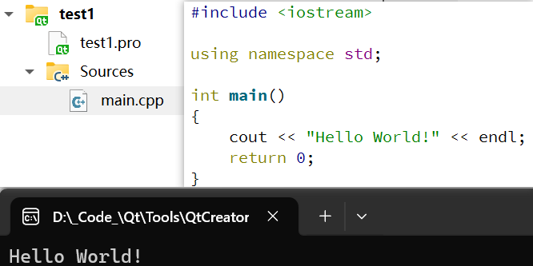 

以纯C++工程来测试Qt开发环境是否安装成功：

在  “ 欢迎 --> +New Project , 选择    Non-Qt Project --> Plain C++ Application    --> Choose

Location：填写 ” 项目名称、创建路径    (项目名称为project，路径体现项目的功能)

Build System：选择qmake

Kits：选择Desktop Qt 5.11.1 MinGW 32bit

下一步，直到完成创建，Qt默认创建了一些代码，结果是输出 "Hello World!"

点击左下角绿色三角形 “运行” Ctrl+R，输出 Hello World！，说明Qt开发环境搭建成功。

## Qt工程说明

.pro：为Qt工程文件，包含工程的配置信息

main.cpp：主函数

​        `#include <iostream>`    // 包含 C++标准头文件

​                                                    // 类似 C标准头文件 stdio.h

​        `using namespace std;`    //使用std域名中的内容，如函数、关键字

​        `cout`    //标准输出关键字

​        `endl`    //输出结束符

# 2、C++基础

示例：test2工程

 

## 什么是C++？

C++是C的升级版，在C的基础上增加了很多功能，是一种高级语言。

在C++里面，所有C的关键字都可以使用

## 什么是面向对象，什么是面向过程

C是面向过程的，C++是面向对象的

举例：计算 a+b

直接计算  a+b ，就是面向过程

面向对象，就是先把 a+b 封装到类，形成一个方法，再通过类去调用 a+b。给 a+b 穿上一层衣服，不是直接计算a+b。

​        这样做的好处是方便移植和使用。

## C++的类

C++的灵魂是类

C的灵魂是指针

类 可看成是C结构体的升级版，C结构体可包含若干变量，成员变量的类型可以不同(指针也是一种类型，所以C结构体可包含函数指针)

类的成员，不仅可以是变量，也可以是函数

## 如何定义一个类

关键字：class

关键字+类的名称+类的成员

```c++
class student
{
public:
    char name[56];
    int age;
};
```

## 什么是对象

对象是类的实例化

通过类定义的变量就是对象

直接定义：

```c++
student my;    //student 就是类，my 就是对象
```

在堆里面定义：

​    *my1 是指针

​    定义在堆里的对象，函数结束时，不会被删除，所以需要使用 delete 释放堆的内存

```c++
student *my1 = new student;
delete my1;    //删除在堆里定义的对象，目的是释放堆的内存
```

## 怎么访问类的成员

访问方法和C是一样的

普通变量通过 "." 来访问

```c++
my.age = 18;
cout << my.age << endl;    //打印
```

指针通过 "->" 来访问

```c++
my1->age = 19;
cout << my1->age << endl;    //打印
```

## 类的函数成员

第一步：在类里面申明

第二步：实现函数功能，可以直接写在类的里面，也可以写在类的外面

写在类的里面：

```c++
class student
{
public:
    char name[56];
    int age;
    
    void test()
    {
        cout << 150 << endl;
    };
};
```

写在类的外面：

```c++
class student
{
public:
    char name[56];
    int age;
    
    void test();
};

void student::test()    //student:: 表示属于这个类里面的函数。不加则会表示普通函数
{
    cout << 150 << endl;
};
```

第三步：访问类的函数成员

与访问类的普通成员是一样的

```c++
my.test();

my1->test();
```

## 类的访问修饰符

是对类的成员进行权限管理。

public：表示公开的成员，这个类的任何对象都可以访问。

private：表示私有的成员，只能在类的里面访问，不能通过对象来访问

​    怎么强行访问私有成员：如果在类的里面定义了一个public 的函数，又在该函数中引用了这个 private成员，这样访问该函数时，就访问了该私有成员

```c++
class student
{
public:
    char name[56];
    int age;
    
    void test();
private:
    int haha;
};

void student::test()    //student:: 表示属于这个类里面的函数。不加则会表示普通函数
{
    haha = 150;
    cout << haha << endl;
};
```

protected：表示受保护的成员，只能在类及其派生类(子类)里面访问

## 类函数的重载特性

可以在类里面定义**重名而参数不同**的函数

重载函数在调用时，会根据参数的类型，匹配相应的函数进行调用

```c++
class student
{
public:
    char name[56];
    int age;
    
    void test();
    void test(int a);    //重载函数
private:
    int haha;
};

void student::test()    //student:: 表示属于这个类里面的函数。不加则会表示普通函数
{
    haha = 150;
    cout << haha << endl;
};

void student::test(int a)    //student:: 表示属于这个类里面的函数。不加则会表示普通函数
{
    cout << a << endl;
};

/* 重载函数调用 */
my.test();

my.test(0);
```

## 构造函数和析构函数

构造函数：假如定义了构造函数，当对象被创建时，将触发构造函数

析构函数：假如定义了析构函数，当对象被删除或者生命周期结束时，将触发析构函数

构造函数和析构函数作为可选项在类里面被定义，其中，构造函数可以被重载，析构函数不可被重载

如果构造函数和析构函数中带参数，则只能使用在堆里面定义对象，并且给对象指针传递参数

怎么定义构造函数和析构函数：

1.构造函数和析构函数的名称必须与类的名称一样；

2.析构函数在前面加 "~"

```c++
class student
{
public:
    student();    //构造函数
    student(int b);    //重载构造函数
    ~student();    //析构函数

    char name[56];
    int age;

    void test();
    void test(int a);    //重载函数
private:
    int haha;
};

student::student()
{
    cout << "Hello!" << endl;
};

student::student(int b)
{
    cout << b << endl;
};

student::~student()
{
    cout << "Bye!" << endl;
};

/* 在堆里面定义对象，并且给对象指针传递参数 */
student *my2 = new student(10);
delete my2;
```

## 类的继承

允许在子类中继承父类的 public 和 protected 部分的成员，private 部分的成员不能被继承

当父类不好的时候，可以使用类的继承，在子类中添加需要的功能

如何在子类中访问父类的成员：

​    也是通过 "." 和 "->" 来访问

```c++
class 子类 : public 父类
{
public:
    ... ...
protected:
    ... ...
}

class mystudent:public student
{
public:
    int grade;
};

/* 在子类中访问父类的成员 */
mystudent my3;

my3.grade = 99;
my3.age = 8;
```

## 虚函数和纯虚函数

虚函数：有实际定义的，允许子类对其进行覆盖式的替换，用在类的继承上。关键字：virtual

纯虚函数：没有实际定义的虚函数

虚函数的优点：可以预留接口，实现分工合作

怎么定义虚函数：

```c++
class student
{
public:
    student();    //构造函数
    student(int b);    //重载构造函数
    virtual ~student();    //析构函数

    char name[56];
    int age;

    virtual void test();    //虚函数
    virtual void test(int a);    //重载虚函数

    virtual void testa(){};    //纯虚函数
private:
    int haha;
};

void student::test()    //student:: 表示属于这个类里面的函数。不加则会表示普通函数
{
    haha = 150;
    cout << haha << endl;
};

class mystudent:public student
{
public:
    int grade;

    void test();
};

void mystudent::test()    //student:: 表示属于这个类里面的函数。不加则会表示普通函数
{
    /* 在子类里面对父类定义的虚函数进行覆盖式的替换 */
    cout << 123 << endl;
};

my3.test();    //因为在子类中重写了test()函数，所以这里应该打印值为123，而不是父类中的test()函数打印值150
```

[警告： deleting object of polymorphic class type ' ' which has non-virtual destructor might cause undefined behaviour-CSDN博客](https://blog.csdn.net/wanlijunjun/article/details/53606352)

​    如果基类里有虚函数，定义了基类指针指向派生类，就会需要定义基类虚析构，这样，基类指针析构的时候，就会先析构派生类，再析构基类。如果不定义虚析构，就会基类指针直接析构基类。这样派生类对象销毁不完整。所以编译器报警告。

# 3、Qt基础

Qt的移植性非常强，一套代码不需要改太多，直接通用所有平台

示例：class1工程

 

## 新建工程

在  “ 欢迎 --> +New Project , 选择    Application --> Qt Widgets Application --> Choose

Location：填写 ” 项目名称、创建路径    (项目名称为项目的功能 英文)

Build System：选择qmake

Kits：选择Desktop Qt 5.11.1 MinGW 32bit

Details：基类选择 Widget

下一步，直到完成创建，

## 工程文件分析

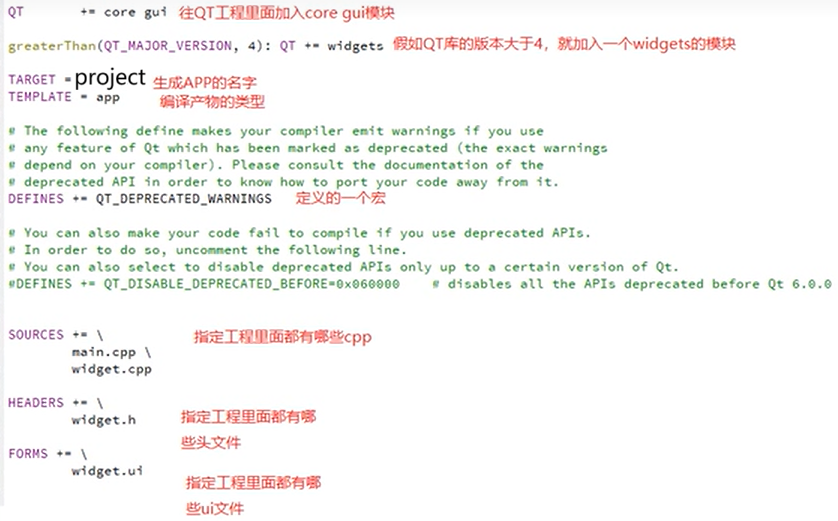 

若要改变工程的路径，需用记事本打开`project.pro.user`文件，将其中的路径全部替换为目标路径

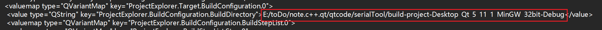 

## 进入设计界面

双击 “ Forms --> widget.ui ，进入设计界面

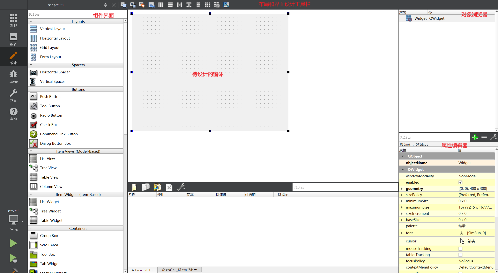 

## ui界面设计

左键选择组件界面中所需的组件，拖放到待设计的窗体界面，完成组件的放置

左键选择待设计的窗体界面中的窗体、组件等，在 属性编辑器 中修改外轮廓尺寸、文本大小、布局等


放置文本、图片、GIF等的组件：Label，在 组件界面 --> Display Widgets --> Label 

输入一行文本的组件：Line Edit，在 组件界面 --> Input Widgets --> Line Edit 

​        密文模式：设置QLineEdit --> echoMode (回显模式) : Password

按钮的组件：Push Button，在组件界面 --> Buttons --> Push Button


## 给组件重命名

为了分析代码方便，要给组件重命名 (英文)，要通俗易懂

选择组件，在对象浏览器中对该组件重命名

## Qt信号和槽

可以在  帮助 --> 索引 --> Look for 要查找的组件

比如按钮组件，搜索 QPushButton ，在继承自 Inherits:QAbstractButton 中找到 Signals (信号)，可看到 QPushButton 有4种信号

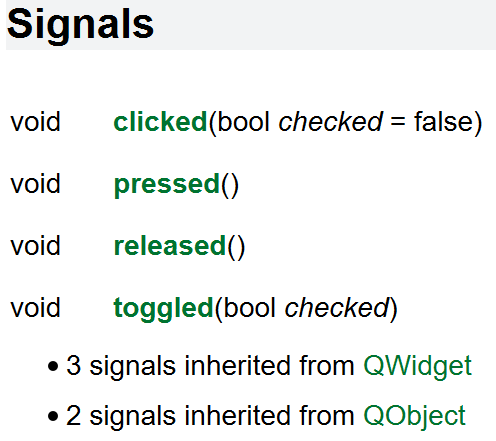 

信号：指组件发出的特定信号

槽：即槽函数，可以将槽函数与组件的信号绑定，当触发该组件的该信号时，执行槽函数

​        与中断和中断函数类似

关联信号和槽：

​    1.自动关联

选择组件，右键 --> 转到槽 --> 选择需要的信号，会给工程添加该信号对应的槽函数

会在 Widget.h文件，Widget类定义中的 private slots 或者 public slots 中声明

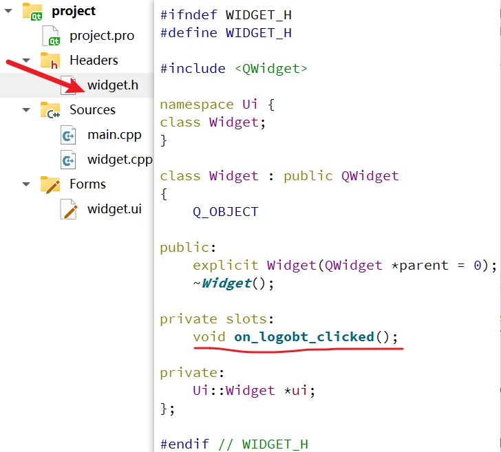 

会在 Widget.cpp文件，定义该槽函数，用户只需在其中编写所需的功能

 

```c++
qDebug("logoBt_clicked");    //打印
```

​    2.手动关联

槽函数的声明和定义，与自动关联一样，但是槽函数的名称应该改为自己的，如果手动关联也将槽函数的名称写为Qt默认的，则当组件触发一次信号，执行两次槽函数

还需使用 connect() 函数

```c++
connect(ui->registerBt,SIGNAL(clicked()),this,SLOT(on_registerBt_clicked()));    //手动关联信号和槽
```

这里我定义的槽函数为 on_registerBt_clicked() 跟Qt 系统的槽函数名称一样，效果是点击一次注册，打印了两次 registerBt_clicked ，需要将槽函数的名称改变成自己的 ，我改为 u_registerBt_clicked()

```c++
connect(ui->registerBt,SIGNAL(clicked()),this,SLOT(u_registerBt_clicked()));    //手动关联信号和槽

connect(A,SIGNAL(B),C,SLOT(D));
当对象A发出信号B时，就会触发对象C的槽函数D
```

## 给界面添加图片

添加图片资源文件：

在  编辑，项目树中，右键项目的目录文件，选择 添加新文件，文件和类 选择  Qt --> Qt Resource File，点击 Choose，名称 可写 pic，下一步，完成。保存项目。

将准备好的图片文件放在项目文件夹下 (main.cpp目录下)

在 Resources 下，右键 pic.qrc ，选择 open with --> 资源管理器，点击 添加 --> 添加前缀，这里设置成根目录 "/"，保存。

再选择 添加 --> 添加文件，选择前面准备的图片文件，点击打开。

引用图片：

打开 Widget.ui ，进入 设计 界面，拖放一个 Label 组件，删除文字，右键 选择 改变样式表 ，点击 添加资源 下拉选项，选择 border-image，点击 <resource root> ，右侧会显示 前面添加到工程的图片，点击 OK。

若想点击图片，触发一些功能，可以在Push Button组件上引用图片，然后设置所需的信号和槽

修改图片的大小，选择组件，在属性编辑器中设置 minimumSize 中的宽度、高度

## 界面布局

1.水平布局

2.垂直布局

3.栅格布局

为了适配不同大小的窗口、不同分辨率的屏幕，需要设置界面布局

先使用左键框选需要布局的组件，再在 布局和界面设计工具栏 中选择需要的布局

在窗体与组件之间空余部分的左右两边加入两个水平弹簧、上下两边加入两个垂直弹簧，在选择窗体，选择栅格布局。这样窗体中的组件就可以随着窗体大小的改变，自动调整布局

要重新布局，先选中布局，点击 打破布局，在相邻组件之间添加弹簧，这样组件之间就有空隙了，不会挤在一起

## 界面切换

创建新的ui界面：

在项目树中，右键 项目的目录文件，选择 添加新文件，文件和类 选择  Qt --> Qt 设计师界面类，点击 Choose，Form Template 选择界面模板 Widget ，下一步，Class Details 选择 类名，根据界面的功能，填写 类名，下一步，完成。

编辑槽函数：

在主窗体的源文件中 widget.cpp，将主窗体中登录组件的槽函数重新编辑

```c++
#include "ctrl.h"

void Widget::on_logoBt_clicked()
{
    //qDebug("logoBt_clicked");    //打印

    ctrl *ct = new ctrl;    //新建对象
    ct -> setGeometry(this -> geometry());    //获取当前窗体的几何参数
    ct -> show();    //显示新的窗体
}
```

添加 判断账号和密码 正确才跳转 新界面的功能

```c++
void Widget::on_logoBt_clicked()
{
    //qDebug("logoBt_clicked");    //打印

    /* 获取账号和密码 */
    QString userName = ui -> userEdit -> text();
    QString passwd = ui -> passwdEdit -> text();

    /* 判断账号和密码 */
    if(userName == "123" && passwd == "123")
    {
        /* 切换界面 */
        ctrl *ct = new ctrl;    //新建对象
        ct -> setGeometry(this -> geometry());    //获取当前窗体的几何参数
        ct -> show();    //显示新的窗体
    }
}
```

# 4、Qt串口助手

示例：serialTool工程

## 设计ui界面

接收区域：使用 Plain Text Edit 组件，勾选 readOnly 只读

发送区域：使用 Line Edit 行编辑组件

下拉菜单：使用 Combo Box 组合框组件，双击组件 进入编辑组合框，新建项目，如果需要设置默认值，可将其放在第一位，也可在属性编辑中将 currentIndex 设置成所需值的位 (新建项目从上到下的位，依次从0、1、2 ...排列)

广告区域：使用 Group Box 组框组件，在其中添加 Label 标签组件

将所添加的组件按功能特征重命名，以便后续的编程

按所需将界面布局

## 实现逻辑功能

1.需要在工程文件中添加 serialport 模块

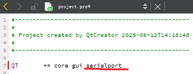 

2.获取串口号

```c++
#include <QSerialPortInfo>    //包含串口信息类

/* 获取并显示串口号 */
QStringList serialNamePort;
//其中 QSerialPortInfo::availablePorts() 自动搜索可用的串口，返回值是一个数组，数组的元素是 QSerialPortInfo 类型，用变量 serialNamePort 来接这些数组
foreach (const QSerialPortInfo &info , QSerialPortInfo::availablePorts() ) {
    serialNamePort << info.portName();
}
ui -> serialCb -> addItems(serialNamePort);
```

3.定义串口的类

在 widget.h 中包含 #include <QSerialPort> ，并定义 QSerialPort *serialPort;

在 widget.cpp 中定义 serialPort = new QSerialPort(this);

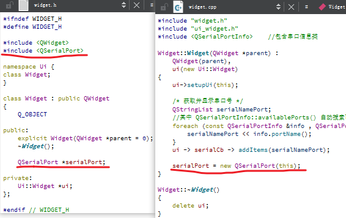 

4.打开串口

这里使用开始按钮，触发初始化串口

右键 开始按钮，转到槽，选择 点击 信号，在槽函数 void Widget::on_openBt_clicked() 里写入

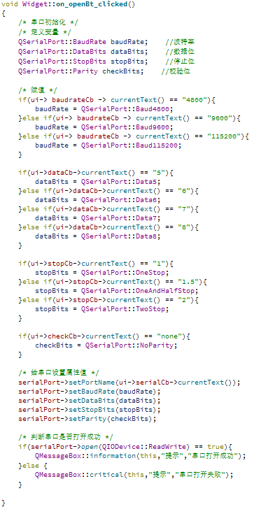 

5.关闭串口

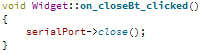 

6.串口接收

```c++
/* 定义串口就收的信号和槽
   当串口助手有可读的内容时，发出 SIGNAL(readyRead()) 信号，触发 serialPortReadRead_Slot() 槽函数 */
connect(serialPort,SIGNAL(readyRead()),this,SLOT(serialPortReadRead_Slot()));

void Widget::serialPortReadRead_Slot()
{
    QString buf;
    buf = QString(serialPort->readAll());    //接收读到的内容
    ui->recvEdit->appendPlainText(buf);    //发送到 recvEdit 组件中
}
```

7.串口发送

```c++
void Widget::on_sendBt_clicked()
{
    serialPort->write(ui->sendEdit->text().toLocal8Bit().data());    //当点击sendBt发送按钮时，将sendEdit 发送编辑区的内容发送出去，将数据类型转换为char型
}
```

8.清空

```c++
void Widget::on_clearBt_clicked()
{
    ui->recvEdit->clear();
}
```

## 程序打包和部署

将Qt程序打包成Windows可执行程序，便于分发给用户使用

程序的源码，不会轻易提供给别人

1.将工程切换到 release 模式，再编译

release 模式：基本没有调试信息，编译的结果比较精简

debug 模式：有很多调试信息，编译的结果比较臃肿

2.打开 release 模式 构建的工程路径

```
build-project-Desktop_Qt_5_11_1_MinGW_32bit-Release
```

在其中的 release 文件夹里面，生成有 .exe 文件

3.给 可执行程序添加图标
注意：格式为 .ico

路径为 main.cpp 路径

再在 .pro 文件最后添加 `RC_ICONS = serialTool.ico` ，再重新编译即可

4.封包

1.新建程序文件夹，用来存放 可执行文件、所需的动态库

2.将前面 release 模式下生成的 .exe 文件 拷贝进 程序文件夹中

3.在Windows开始菜单打开Qt控制台

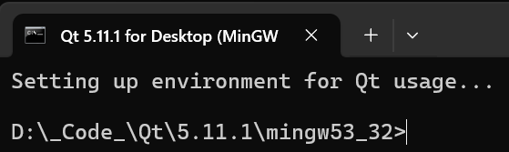 

进入程序文件夹，输入 `cd /d 程序文件夹的路径`

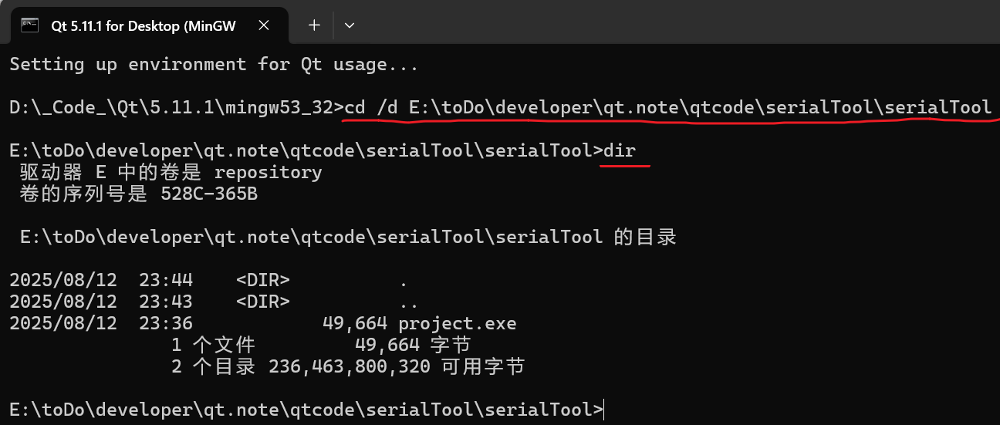 

然后输入 `windeployqt project.exe` 回车，向程序文件夹添加 所需的动态库

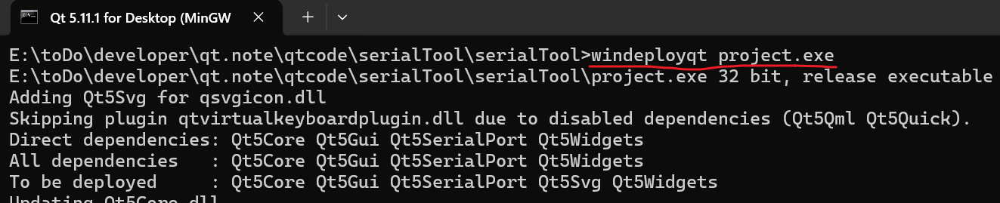 

至此，该程序文件夹就可以独立运行其中的可执行文件了，可以将其压缩分发。用户只需要解压缩，并使用其中的 .exe可执行程序即可。

`就是打包后的 程序文件夹 有点大！！！！！！！！`

# 5、Qt网络编程

## TCP通信

TCP通信需用到两个类： `QTcpServer` 、 `QTcpSocket`

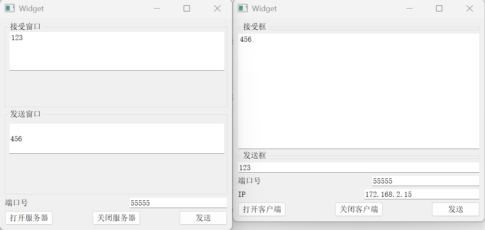 

### 服务器

示例：netWork\TcpServer 工程

服务器用到了 QTcpServer 和 QTcpSocket

新建工程

在头文件、工程文件添加类

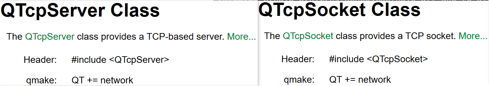 

定义新对象

```c++
QTcpServer *tcpServer;
QTcpSocket *tcpSocket;

tcpServer = new QTcpServer(this);
tcpSocket = new QTcpSocket(this);
```

设计ui界面

接受框：使用 Plain Text Edit 组件

发送框：使用  Line Edit 行编辑组件

### 客户端

示例：netWork\TcpClient 工程

客户端只用到了 QTcpSocket

查看本机的IP：Windows开始菜单 搜索 `cmd` ， `ipconfig`

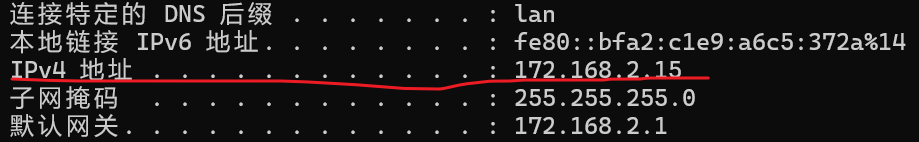 

## UDP通信

示例：netWork\Udp

UDP通信不分客户端和服务器，只需用到一个类：QUdpSocket

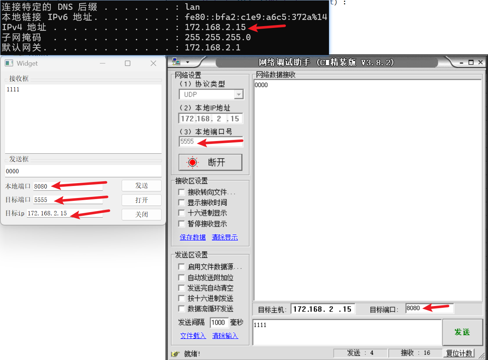 

# 6、Qt时钟

需要用到两个类：qtime (时间类)、qtimer (定时类)

示例：time工程

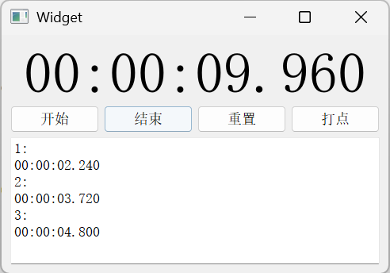 

# 7、构建根文件系统

BusyBox 工具官网：[BusyBox](https://busybox.net/)

进入官网，在左侧点击 Get BusyBox -> Download Source -> 下载版本 "busybox-1.29.0.tar.bz2"

首先配置好Ubuntu系统，下面在Ubuntu终端操作

在用户目录新建一个目录存放 BusyBox ，这里我的目录是 mainzh/qt#/

将压缩文件拷贝进目录，解压缩

进入目录 mainzh/qt#/busybox-1.29.0

输入 `make menuconfig`


# Qt操作GPIO

 
