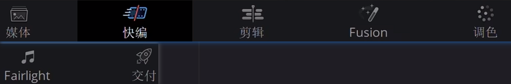
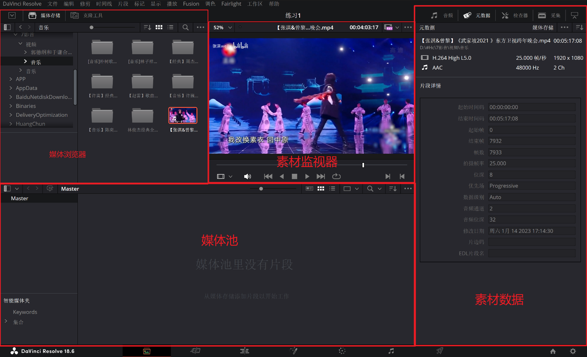
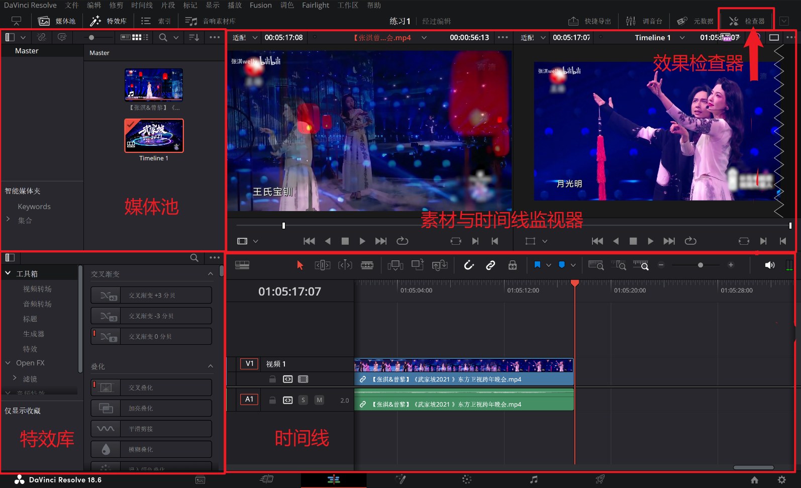
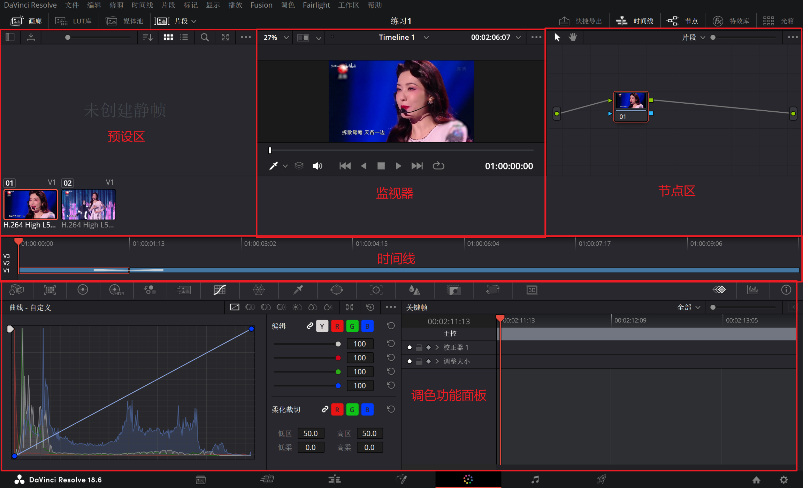
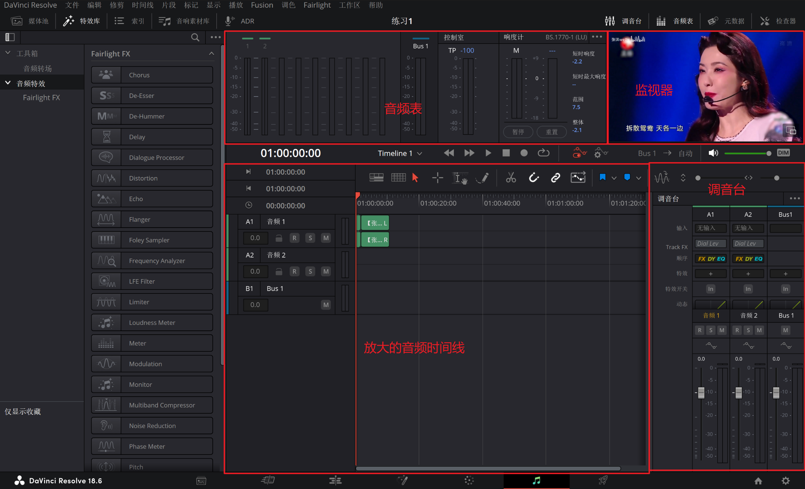
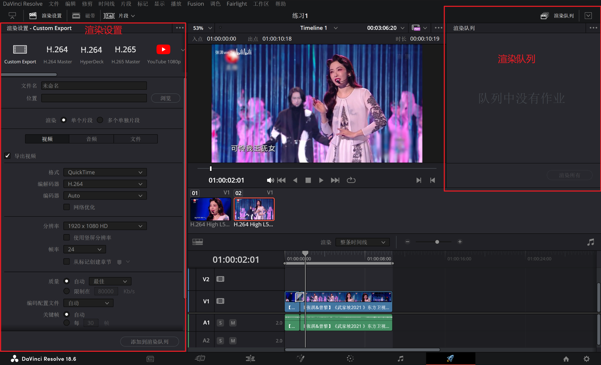

达芬奇

[【何同学】如何在B站学习做视频？ (P2附Pr零基础剪辑教程）_哔哩哔哩_bilibili](https://www.bilibili.com/video/BV1EW411R77n/?vd_source=b6cd6dd41c0769968f58ce886d249f74)

[B站视频制作教程推荐 - 哔哩哔哩 (bilibili.com)](https://www.bilibili.com/read/cv960192/)

[影视飓风将停止制作25帧视频_哔哩哔哩_bilibili](https://www.bilibili.com/video/BV1hp4y1f7B5/?vd_source=b6cd6dd41c0769968f58ce886d249f74)

软件

[【干货】一小时上手达芬奇剪辑！第一集：入门简介_哔哩哔哩_bilibili](https://www.bilibili.com/video/BV1B7411A7M1/)

[【于干的剪辑教程】20分钟入门Premiere剪辑_哔哩哔哩_bilibili](https://www.bilibili.com/video/BV1Hs411E7Z7/?vd_source=b6cd6dd41c0769968f58ce886d249f74)

官网：[Blackmagic Design](http://www.blackmagicdesign.com/cn)

教程：[B站-影视飓风-合集·【干货】一小时上手达芬奇！](https://space.bilibili.com/946974/channel/collectiondetail?sid=284&spm_id_from=333.788.0.0)

### 入门简介

各个面板的作用

#### "项目管理器面板"

"新建项目\项目命名和保存Ctrl+S"。

设置：DaVinci Resolve\偏好设置\用户\UI设置\语言\简体中文。

设置：。。。   。。。   。。。  。。。 \项目保存和加载\实时保存\项目备份。

底部"仅显示图标"，不能选择"显示图标与标签"，因"UI显示比列"为自动，分辨率太高，屏幕太小导致，不影响。

#### 创作流程

功能面板

导入素材进行分类："媒体面板"；

板块："媒体浏览器"、"素材监视器"、"媒体池"、"素材数据"。

设置："文件\项目设置\时间线帧率"，设置为合适的帧率，避免不同素材的帧率不同而跳帧或卡顿。

导入素材流程：通过"媒体浏览器"，找到素材所在目录，在"素材监视器"中回看，查看"素材数据"，拖入"媒体池"中(通过新建媒体夹，对素材分类，也可直接导入整个素材文件夹)，等待剪辑。

也可以直接从素材目录拖动素材到媒体池。（不推荐，剪辑习惯不好）

2. 视频的粗剪，再精细剪辑："快编面板"、"剪辑面板"；

快编面板和剪辑面板可相互替代。

剪辑面板最常用：

板块："媒体池"、"素材与时间线监视器"、"效果检查器"、"特效库"、"时间线"。

快编面板：界面近似于剪辑面板，合并素材与时间线监视器，添加"时间线总览"，更加适合视频的粗剪。

剪辑流程：在"媒体池"筛选，然后在"素材监视器"用"出入点I、O键"选出有用的素材，然后拖动这段素材到"时间线"，进行拼凑和组装。时间线有多条轨道，可以进行素材叠加，通过"时间线监视器"回看，来构建内容。剪辑时，添加效果或者转场，通过"特效库"，选择对应的音频和视频效果，拖拽到素材上进行添加，然后通过"效果检查器"调整参数(素材缩放、旋转等功能)。

3. 锁定剪辑后，进行调色、音频调整：Fusion面板、调色面板、Fairlight面板；

不推荐"Fusion面板"来制作复杂的效果和动画，其节点式工作逻辑较难掌握，插件和教程较少。推荐使用AE来完成。

"调色面板"非常重要，达芬奇的调色功能非常强大，可以对画面的色彩有完全的掌控。

板块：预设区、监视器、节点区、时间线、调色功能面板

预设区：保存调色预设、LUTS，应用到别的片段，导出截图。

节点区：记录调色操作和效果，每个节点按顺序产生影响。合理使用各种节点，可帮助分离画面的各个区域进行独立调色

调色功能面板：具有各种调色必须的工具，色轮、曲线。任何操作都会被登记在选中的节点上，并对画面产生影响。除了调色，还可以对画面进行稳定、降噪、跟踪。

Fairlight面板：

可以在特效库，针对各种声音添加效果。也可在调音台对整条轨道上的声音进行整体处理。

音频是很重要的部分，清晰的声音可帮助传递内容。

 (4)、视频导出：交付面板。

与剪辑面板类似，增加了渲染设置、渲染队列。

可以选择预设导出，或者自定义。教程：[高画质的背后——视频的封装与编码_哔哩哔哩_bilibili](https://www.bilibili.com/video/BV1ws41157f8/?spm_id_from=333.337.search-card.all.click&vd_source=b6cd6dd41c0769968f58ce886d249f74)

传播互联网，选择mp4封装，H.264编码，确认号帧率、分辨率、码率(编码器)、文件名和导出位置后，点击添加到渲染序列开始渲染。